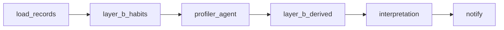

# Profiler 구현 요약

> **스펙 기준:** [SYNAPSE_8.md](./SYNAPSE_8.md) (v1.1 — Layer A + Layer B)

## 개요

Profiler는 Indexer가 저장한 **IndexedRecord[]** 를 입력으로 받아 다음을 산출합니다.

- **Layer A** — Synapse 8각 레이더 (`axes`, 0~100)
- **Layer B** — 인지주권 보조 4지표 (`layer_b`)
- **TOP5** · **요약** · **해석 4요소**

MVP에서는 Indexer 대신 `mocks/` JSON 페르소나를 사용합니다.  
**Navigator**는 Profiler JSON을 **읽기만** 하고, 동일 key에 이상향 목표 점수를 계산합니다.

## 아키텍처 결정 (v1.1)

| 항목 | 결정 |
|------|------|
| 입력 계약 | `IndexedRecord[]` (Indexer `GET /users/{id}/records`와 동일 형태) |
| Layer A (8각) | **Gemini 1-round tool loop** → lightweight structured output |
| Layer B (4지표) | **규칙 기반** — habits(로그) + derived(axes 파생) |
| Layer 2 meta | **API 미노출** (`dominant_axes`, `profile_balance` 등 제거) |
| 이상향 dominant/weak | Navigator가 `axes` 정렬로 **런타임 계산** |
| LLM 미설정 시 | `GOOGLE_API_KEY` 없으면 태그·시청 패턴 fallback |
| Job 저장 | 인메모리 (`runtime/jobs.py`) — 데모/MVP용 |
| 알림·메일 | LangGraph `notify` 노드 — Resend (`synapse@ifive.site`) |
| 분석 요청 | `POST /analyze` — `{ user_id, email }` 필수 |
| API | FastAPI async job — `POST analyze` → 202, `GET jobs/{id}` 폴링 |

## 출력 JSON (v1.1)

```json
{
  "user_id": "mock_jiyeon",
  "computed_at": "2026-06-08T09:00:00Z",
  "axes": { "...": 72 },
  "layer_b": {
    "search_active_ratio": 0.31,
    "viewing_concentration": 0.71,
    "taste_diversity_index": 52,
    "exploration_depth": 0.44
  },
  "top5_interests": [],
  "summary": "...",
  "interpretation": {
    "consumption_mode": "탐색형",
    "primary_lever": "주체성",
    "sovereignty_verdict": "양호",
    "radar_gap_insight": "..."
  },
  "behavior_patterns": { "...": "..." },
  "llm_used": true
}
```

> API에서 Layer A 키는 문서상 `layer_a`, 구현/API 호환용 **`axes`** 사용.

### Layer B 4지표

| key | UI 라벨 | 범위 |
|-----|---------|------|
| `search_active_ratio` | 주체성 | 0~1 |
| `viewing_concentration` | 채널 편중도 | 0~1 |
| `taste_diversity_index` | 취향 다양성 | 0~100 |
| `exploration_depth` | 탐색 깊이 | 0~1 |

상세 정의·수식: [SYNAPSE_8.md §5](./SYNAPSE_8.md#5-layer-b--인지주권-4지표-layer_b)

## 파이프라인

```
load_records → layer_b_habits → profiler_agent → layer_b_derived → interpretation → notify
```



| 노드 | 파일 | 호출 모듈 |
|------|------|-----------|
| `load_records` | `subagent/load_records/node.py` | `load_records/loader` |
| `layer_b_habits` | `subagent/layer_b/habits.py` | `subagent/scoring`, `subagent/patterns` |
| `profiler_agent` | `subagent/profiler_agent/node.py` | `profiler_agent/analysis`, `profiler_agent/tools` |
| `layer_b_derived` | `subagent/layer_b/derived.py` | `subagent/scoring` |
| `interpretation` | `subagent/interpretation/node.py` | `interpretation/rules` |
| `notify` | `subagent/notify/node.py` | `notify/mail` (Resend), `notify/in_app` |

## 파일 구조

```
profiler/
├── load_env.py
├── graph.py             # LangGraph 오케스트레이션
├── schemas.py           # API 요청/응답
├── api.py               # FastAPI 라우터
├── base/                # Pydantic 도메인 모델
│   ├── record.py        # IndexedRecord, bundle
│   ├── axes.py          # Synapse 8각, AxesDelta
│   ├── layer_b.py       # LayerB, LayerBDelta
│   ├── profile.py       # ProfilerResult, TOP5, 해석
│   ├── graph.py         # GraphViewData nodes/edges
│   ├── insights.py      # snapshot, compare, ideal
│   └── job.py           # JobStatus, PersonaInfo, events
├── state/               # LangGraph 상태
│   └── profiler.py      # ProfilerState
├── subagent/            # 파이프라인 노드 + 분석 로직
│   ├── scoring.py           # Layer B·8축 fallback·집계 (공유)
│   ├── patterns.py          # 시간대·주말·반복 패턴 (공유)
│   ├── load_records/
│   │   ├── node.py
│   │   └── loader.py        # mock JSON / 페르소나 목록
│   ├── layer_b/
│   │   ├── habits.py
│   │   └── derived.py
│   ├── profiler_agent/
│   │   ├── node.py
│   │   ├── prompt.py
│   │   ├── analysis.py      # Gemini tool loop + structured output
│   │   └── tools.py         # LLM investigation tools
│   └── interpretation/
│       ├── node.py
│       └── rules.py         # §9 해석 4요소
│   └── notify/
│       ├── node.py          # LangGraph 마지막 노드
│       ├── mail.py          # Resend (synapse@ifive.site)
│       └── in_app.py        # notification payload
├── runtime/             # API 실행·부가 기능 (시연용 mock)
│   ├── jobs.py              # 비동기 job (notify 결과 → job.notification)
│   └── insights/
│       ├── snapshots.py     # 버전별 프로필 JSON 저장/조회
│       ├── history.py       # 스냅샷 compare + anomaly
│       ├── graphs.py        # taste / knowledge 그래프
│       └── extras.py        # ideal-gap + behavior events
├── mocks/
│   ├── mock_*.json          # 페르소나 records
│   ├── manifest.json
│   ├── snapshots/{user}/    # v1, v2 …
│   ├── ideal/{user}.json
│   └── events/{user}.jsonl
├── scripts/
│   └── run_test.py
├── documents/
│   ├── SYNAPSE_8.md
│   └── IMPLEMENTATION.md
└── SYNAPSE_8.md         # → documents/SYNAPSE_8.md 리다이렉트
```

### 모듈 역할 요약

| 덩어리 | 경로 | 역할 |
|--------|------|------|
| 분석 엔진 | `subagent/` | LangGraph 노드가 직접 호출 — 8축·Layer B·해석 |
| 데이터 | `subagent/load_records/loader.py` | mock 로드 |
| 실행 | `runtime/jobs.py` | POST /analyze 백그라운드 실행 |
| 부가 API | `runtime/insights/` | 스냅샷·비교·그래프·이상향·이벤트 |

## API (`/api/v1/profiler`)

| Method | Path | 설명 |
|--------|------|------|
| `POST` | `/analyze` | `{ "user_id", "email" }` → `{ "job_id", "status" }` (202) |
| `GET` | `/jobs/{job_id}` | job 상태·결과·notification |
| `GET` | `/profile/{user_id}` | 마지막 완료 프로필 |
| `GET` | `/personas` | mock 페르소나 목록 |
| `GET` | `/profile/{user_id}/snapshots` | 저장된 스냅샷 버전 목록 |
| `GET` | `/profile/{user_id}/snapshots/{version}` | 특정 버전 스냅샷 |
| `GET` | `/profile/{user_id}/compare?from=&to=` | axes/layer_b delta + anomalies |
| `GET` | `/profile/{user_id}/graph?kind=taste\|knowledge` | 시각화용 nodes/edges |
| `GET` | `/profile/{user_id}/ideal-gap` | 이상향 mock 대비 gap (Navigator 연동 전 시연) |
| `GET` | `/profile/{user_id}/events` | 행동 이벤트 mock 집계 |

스키마·라우터: `profiler/schemas.py`, `profiler/api.py`  
앱 진입점: `backend/app/main.py` → `uvicorn app.main:app`

## Mock 페르소나

| id | Layer A 특성 | Layer B 기대 패턴 |
|----|-------------|-------------------|
| `mock_minsu` | Shorts·밈·예능 | `viewing_concentration` ↑, `exploration_depth` ↓~중 |
| `mock_jiyeon` | 튜토리얼·생산성·다큐 | `taste_diversity_index` ↑, `search_active_ratio` 중~↑ |
| `mock_hyunwoo` | 뉴스·시사 단일 채널 | `viewing_concentration` **매우 ↑** |

`mock_jiyeon`은 `mocks/snapshots/`에 v1·v2가 있어 `/compare` 데모에 사용합니다.

## Indexer 연동 (팀 계약)

```
GET /api/v1/indexer/users/{user_id}/records
→ IndexedRecordsBundle (records[] 동일 스키마)
```

| Layer B 지표 | 필요 필드 |
|-------------|-----------|
| 주체성 | `source_type: search` |
| 채널 편중도 | `channel`, `duration_sec` (watch) |
| 탐색 깊이 | `channel`, `duration_sec`, `recorded_at`, `tags` |
| 취향 다양성 | Layer A 산출 후 내부 계산 |

## 환경 변수

| 변수 | 기본값 | 설명 |
|------|--------|------|
| `GOOGLE_API_KEY` | (없음) | Gemini API 키 |
| `GEMINI_API_KEY` | (없음) | `GOOGLE_API_KEY` 대체 가능 |
| `GEMINI_MODEL` | `gemini-2.5-flash` | Profiler LLM 모델 |

로컬 설정 (`backend` 폴더):

```bash
copy .env.example .env   # Windows
# GOOGLE_API_KEY= 에 Gemini 키 입력
```

`backend/.env`는 실행 위치와 관계없이 `profiler/load_env.py`가 자동 로드합니다.

### 로컬 테스트

```bash
cd backend
uv run python -m app.agents.profiler.scripts.run_test --all
uv run python -m app.agents.profiler.scripts.run_test mock_jiyeon --json
```

API 서버:

```bash
uv run uvicorn app.main:app --reload --port 8000
```

## 향후 확장

- [x] 코드 v1.1 마이그레이션 (`layer_b`, `exploration_depth`)
- [x] Gemini tool loop + fallback
- [x] 해석 4요소 · behavior patterns
- [x] 스냅샷·compare·graph·ideal-gap·events API (mock)
- [ ] Indexer 실 API 연동, DB job store
- [ ] Navigator/Frontend — 레이더 + Layer B 게이지

## 변경 이력

| 버전 | 내용 |
|------|------|
| 구현 v0 | axes + meta + auxiliary |
| 구현 v1.1 | axes + layer_b, meta/auxiliary 제거 |
| services 제거 | 분석 로직 → `subagent/`, job·insights → `runtime/` |
| notify + Resend | `subagent/notify/` — 인앱 notification + 완료 메일 |
