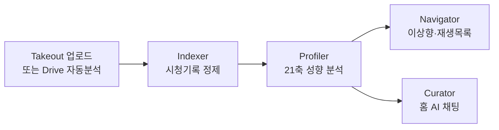
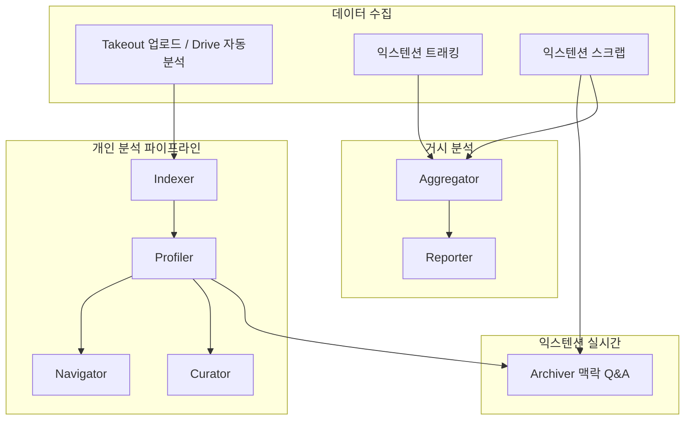

# Synapse (시냅스) 프로젝트 정의

> 플랫폼 마스터 문서. 에이전트별 상세는 [docs/README.md](./README.md) 인덱스를 참고하세요.

---

## 한 줄 정의

**Synapse는 사용자의 디지털 소비 데이터(YouTube 시청 기록, 웹 브라우징, 스크랩)를 수집·분석해 "지금의 나"를 21축 성향 프로필로 시각화하고, "되고 싶은 나(이상향)"를 AI와 함께 설계한 뒤, 그 격차를 좁히는 맞춤 콘텐츠(재생목록·가이드)를 제공하는 자기이해·자기설계 플랫폼**입니다.

---

## 제품 철학

이름 **Synapse(시냅스)** 는 뇌의 시냅스처럼, 흩어진 디지털 활동을 하나로 연결한다는 뜻을 담습니다.

- **"데이터로 나를 읽고, 나를 설계한다"** — 수동적 알고리즘 소비를 넘어, 자신의 소비 패턴을 거울로 삼아 의도적 성장을 돕습니다.
- **"당신의 유튜브 시청기록이 곧 당신이다"** — 시청 기록을 단순 로그가 아니라 자기 진단 데이터로 뒤집습니다.

## 이중 가치: B2C + B2B

| 차원 | 가치 | 핵심 흐름 |
|------|------|-----------|
| **B2C (개인)** | 자기이해 · 이상향 설계 · 행동 실행 | 현재 성향 → 이상향 → 재생목록·가이드 |
| **B2B (플랫폼)** | 비식별 거시 트렌드 인사이트 | Aggregator 일별 집계 → Reporter 지식 그래프·리포트 |

같은 데이터 철학을 **개인 진단**, **집단 트렌드**, **일상 수집**이라는 세 표면으로 구현합니다.

## 대상 사용자

- **개인 사용자**: YouTube·웹 소비가 많고, 자기 성향을 객관적으로 파악하고 싶은 사람
- **성장 지향 사용자**: "되고 싶은 나"를 설계하고 실제 시청·행동으로 연결하고 싶은 사람
- **조직·운영자**: 플랫폼 전체의 거시 트렌드(6대 도메인, 키워드)를 활용하는 B2B 리포트 소비자

## 핵심 차별점

1. **심리학 기반 21축** — Schwartz 가치관 10 + TCI 기질 3 + 행동 스파이더 8
2. **실제 행동 데이터** — Takeout 시청 기록, 익스텐션 트래킹·스크랩, Drive 자동분석
3. **멀티에이전트 오케스트레이션** — LangGraph 상태 머신 + SSE 실시간 스트리밍
4. **닫힌 루프** — 진단 → 이상향 → 재생목록·YouTube 저장까지 실행 단계까지 연결

---

## 핵심 사용자 여정

### 개인 분석 루프



### 확장·거시 분석 루프



### 배치 분석 흐름

여러 Takeout 파일을 한 번에 올릴 때 **배치(batch)** 단위로 묶어 분석합니다.

1. 프론트가 `batch_id`로 파일들을 순차 업로드 (`POST /api/v1/indexer/analyze`)
2. 업로드 완료 후 **seal** 신호 (`POST /api/v1/indexer/batch/{batch_id}/seal`) → 배치 상태 `open → sealed`
3. 각 소스별 Indexer 파이프라인 완료 대기
4. 배치에 속한 영상만 스코프해 **Profiler 1회** 실행
5. 결과는 `user_profile_history`에 `batch_id`와 함께 스냅샷으로 저장

관련 DB: `analysis_batch`, `user_analysis_source`, `analysis_source_catalog` — [erd.md](./erd.md) 참고.

### 백그라운드 스케줄러

앱 기동 시(`backend/app/main.py`) 다음 작업이 자동 실행됩니다.

| 스케줄러 | 역할 |
|----------|------|
| `takeout_scheduler` | Drive 폴더 감시, 월별 자동 Takeout 분석 |
| `aggregator_scheduler` | 일별 거시 트렌드 배치 |
| `playlist_refresh_scheduler` | 이상향 재생목록 주기 갱신 |
| 분석 배치 정리 | 고아 소스·진행 중 job 정리 |

---

# 21축 성향 모델

Profiler가 산출하는 성향 프로필의 이론적 기반과 축 구성입니다.  
소스: `backend/app/agents/profiler/prompts.py`, `axis_labels.py`

## 구성 요약

| 계층 | 축 수 | 이론 기반 | 산출 방식 |
|------|-------|-----------|-----------|
| 가치관 | 10 | Schwartz Basic Human Values | LLM 1단계 |
| 기질 | 3 | TCI (Temperament and Character Inventory) | LLM 1단계 |
| 행동 스파이더 | 8 | 가치·기질에서 파생 | 규칙 + LLM 2단계 보정 |

## Schwartz 가치관 10축

| 키 | 한국어 라벨 | 설명 |
|----|------------|------|
| `self_direction` | 자기지향 | 독립·창의·자율 추구 |
| `stimulation` | 자극 | 새로움·도전·변화 추구 |
| `hedonism` | 쾌락 | 즐거움·편안함 추구 |
| `achievement` | 성취 | 개인적 성공·능력 입증 |
| `power` | 권력 | 지위·영향력·자원 통제 |
| `security` | 안전 | 안정·질서·예측 가능성 |
| `tradition` | 전통 | 관습·종교·문화적 정체성 |
| `conformity` | 순응 | 규범 준수·타인 기대 충족 |
| `benevolence` | 친선 | 가까운 이들의 복지·신뢰 |
| `universalism` | 보편 | 모든 사람·자연에 대한 이해·보호 |

## TCI 기질 3축

| 키 | 한국어 라벨 | 설명 |
|----|------------|------|
| `novelty_seeking` | 탐구성 | 새 자극 탐색·모험 성향 |
| `persistence` | 지속성 | 목표 지향·인내·집중 |
| `self_transcendence` | 자기초월 | 초월적 가치·연대 의식 |

## 행동 스파이더 8축

1단계 점수를 근거로 도출됩니다. 규칙 기반 앵커 + LLM 보정(`calibrate_behavior_spider`)으로 환각을 완화합니다.

| 키 | 한국어 라벨 | 주요 근거 축 |
|----|------------|-------------|
| `exploration` | 탐색 | novelty_seeking, self_direction, stimulation |
| `analytical` | 분석 | achievement, persistence, universalism |
| `creativity` | 창의 | self_direction, stimulation, hedonism |
| `execution` | 실행 | persistence, achievement |
| `achievement_drive` | 성취(행동) | achievement, persistence, power |
| `autonomy` | 자율 | self_direction, stimulation |
| `sociality` | 사회성 | benevolence, conformity |
| `sensitivity` | 감수성 | hedonism, benevolence, self_transcendence |

## 페르소나 라벨

- **13축**(가치관 10 + 기질 3) 상위 축 → **형용사**
- **8축** 행동 스파이더 상위 축 → **명사**
- 조합 예: *"호기심 많은 탐험가"*, *"끈기 있는 분석가"*

## 산출물

| 테이블 | 내용 |
|--------|------|
| `video_analysis` | 영상별 요약·톤·의도·가치 신호·임베딩 |
| `user_profile_history` | 21축 점수·페르소나·포트레이트·해석·근거 스냅샷 |

두 스냅샷 간 변화는 `compare` 서브그래프로 비교합니다 (`GET /api/v1/profiler/me/analyses/compare`).

---

# 전체 아키텍처

하나의 **모노레포**에 3개 앱이 들어 있습니다.

| 경로 | 역할 | 패키지 매니저 |
|------|------|---------------|
| `backend/` | FastAPI API + LangGraph 에이전트 파이프라인 (Python 3.12) | `uv` |
| `frontend/` | Vite + React 19 웹 앱, shadcn/ui | `pnpm` |
| `extension/` | CRXJS 기반 브라우저 확장 (React 19) | `pnpm` |
| `shared/` | 프론트↔익스텐션 인증 프로토콜 (`auth-protocol.ts`) | — |

## 백엔드 레이어

```
app/api (라우터)
  → app/services (비즈니스 로직·오케스트레이션)
    → app/repositories (DB 접근)
      → app/models (SQLAlchemy)
```

그 위에 **7개 AI 에이전트**(`app/agents/`)가 올라갑니다.

## 데이터·AI

- **DB**: PostgreSQL 17 + `pgvector` (비동기 SQLAlchemy + asyncpg)
- **마이그레이션**: Alembic (현재 head: `010_batch_source_catalog`)
- **LLM**: Google Gemini — 분석·채팅 (`gemini-2.5-flash` 등)
- **임베딩**: OpenAI `text-embedding-3-small` (1536차원)

## 인증

| 클라이언트 | 방식 |
|-----------|------|
| 웹 | Google OAuth → HttpOnly 쿠키 (access/refresh) |
| 익스텐션 | Bearer JWT (`chrome.storage`) |
| 웹↔익스텐션 브릿지 | 1회용 `AUTH_CODE` → `extension-exchange` ([`shared/auth-protocol.ts`](../shared/auth-protocol.ts)) |

---

# 핵심 기능 1: 7개 AI 에이전트

Synapse의 심장은 각기 다른 역할을 맡은 에이전트 파이프라인입니다.

## 1) Indexer — 데이터 수집·정제 (L0)

| 항목 | 내용 |
|------|------|
| **역할** | Google Takeout YouTube 시청 기록(JSON/ZIP)과 구독 CSV 파싱·정제·중복 제거 |
| **입력** | Takeout ZIP/JSON, 구독 CSV |
| **출력** | `user_watch_catalog`(시청 정본), `user_subscription`(구독 스냅샷) |
| **파이프라인** | `preprocess → diff → enrich → embed → save_catalog → save_subscriptions` |
| **LLM** | 사용 안 함 (규칙 기반) |
| **특징** | YouTube Data API 메타 보강, OpenAI 1536d 임베딩, 최근 63일 윈도우, 증분 diff |
| **트리거 API** | `POST /api/v1/indexer/analyze`, Drive: `/api/v1/takeout/drive/*` |
| **연동 UI** | `/upload`, Drive 자동분석 설정 |

상세: [indexer/README.md](./indexer/README.md)

## 2) Profiler — 성향 분석 엔진

| 항목 | 내용 |
|------|------|
| **역할** | 시청 catalog 기반 영상 의미 분석 → 21축 성향 프로필 생성 |
| **입력** | `user_watch_catalog`, 배치 스코프(`batch_id`) |
| **출력** | `video_analysis`, `user_profile_history` |
| **파이프라인** | `video_summary → build_profile → notify` |
| **LLM** | Gemini (의미분석·1·2단계 채점), OpenAI (임베딩) |
| **부가** | `compare` 서브그래프, 완료 알림 메일(Resend) |
| **트리거** | Indexer 완료 후 자동 큐잉, `POST /api/v1/profiler/run` |
| **연동 UI** | `/me/analyses`, `/me/analyses/:id`, 비교 페이지 |

상세: [profile/README.md](./profile/README.md)

## 3) Navigator — 이상향 설계·재생목록

| 항목 | 내용 |
|------|------|
| **역할** | "되고 싶은 나" 설계, 격차 분석, 행동 가이드·YouTube 재생목록 처방 |
| **입력** | 최신 프로필 스냅샷, 사용자 대화 |
| **출력** | `user_ideal_persona`, `navigator_playlist`, `navigator_proposal_cache` |
| **핵심 기능** | 3안 제안(반대/강점심화/균형), SSE 대화형 설계, RAG 행동 가이드, YouTube 저장·주기 갱신 |
| **설계** | LLM이 13축 설계 → 규칙으로 8축 파생, RAG 그라운딩 |
| **트리거 API** | `/api/v1/navigator/*` (proposals, chat/stream, ideal, playlists) |
| **연동 UI** | `/me/ideals`, `/me/playlists` |

## 4) Archiver — 웹 맥락 지식 Q&A

| 항목 | 내용 |
|------|------|
| **역할** | 현재 웹페이지 맥락 + 과거 스크랩/대화(RAG) + 웹 검색 조합 Q&A |
| **입력** | TabContext(DOM/메타), 채팅 이력, 하이브리드 RAG |
| **출력** | `ai_chat_logs`, 스크랩(`scraps` + `scrap_embeddings`) |
| **파이프라인** | `router → [collect ∥ rag ∥ search] → evaluator ⇄ 재시도 → respond` |
| **특징** | 근거 부족 시 자율 재검색 루프, "스크랩해줘" 의도 감지 |
| **트리거 API** | `POST /api/v1/archiver/stream`, sessions/history |
| **연동 UI** | 익스텐션 사이드패널 채팅 탭, `/me/scraps` |

상세: [archiver/README.md](./archiver/README.md)

## 5) Curator — 홈 AI 큐레이터

| 항목 | 내용 |
|------|------|
| **역할** | 웹 홈 메인 채팅. 툴 호출로 실제 작업 수행하는 오케스트레이터 |
| **6개 툴** | `query_db`, `search_videos`, `search_analysis`, `get_persona_radar`, `create_playlist`, `save_scrap` |
| **구조** | 단일 `agent_node` — 툴 선택 + 답변 스트리밍 통합 (2026-07 이중 생성 제거) |
| **특징** | 텍스트+이미지 입력, 차트 응답(레이더·영상목록·채널 랭킹), 15종 채팅 테마 |
| **트리거 API** | `POST /api/v1/curator/stream`, sessions |
| **연동 UI** | `/`, `/me` |

상세: [curator/README.md](./curator/README.md)

## 6) Aggregator — 거시 트렌드 배치

| 항목 | 내용 |
|------|------|
| **역할** | 플랫폼 전체 스크랩·시청·행동 로그를 6대 거시 도메인으로 매핑, 일별 비식별 트렌드 집계 |
| **6대 도메인** | Tech/Business, Content/Media, Lifestyle/Wellness, Social/Current Affairs, Knowledge/Education, Economy/TechFin |
| **구조** | 오케스트레이터 + 3 서브에이전트 (Scrap / YouTube / Behavior) |
| **매핑** | 규칙 숏컷 → 애매하면 Gemini → Behavior는 Google Search 그라운딩 |
| **출력** | `global_trends_snapshot` (도메인 분포, 트렌딩 키워드, 8축 평균) |
| **트리거** | 일별 스케줄러, `POST /api/v1/aggregator/trigger` |

## 7) Reporter + shared

| 항목 | 내용 |
|------|------|
| **Reporter** | Aggregator 집계 → 지식 그래프 JSON + B2B 마크다운 리포트 |
| **API** | `/api/v1/reporter/graph`, `/report`, `/charts/stream`, `/charts/heatmap` |
| **연동 UI** | `/reporter/trend-graph` (운영·시연 대시보드) |
| **shared** | Gemini 클라이언트, OpenAI 임베딩, 63일 분석 윈도우, 페르소나 규칙 등 공통 유틸 |

---

# 핵심 기능 2: 웹 앱

라우터: `frontend/src/routes/router.tsx`

## 페이지별 기능

| 경로 | 페이지 | 주요 기능 | 연동 에이전트 |
|------|--------|-----------|---------------|
| `/` | 홈 | Curator SSE 채팅, 이미지 첨부, 차트 응답, 세션 관리 | Curator |
| `/me` | 내 허브 | 분석·이상향·채팅 통합 허브 | Curator, Profiler |
| `/login` | 로그인 | Google OAuth 모달 | — |
| `/download` | 확장 안내 | Chrome 확장 설치 가이드 | — |
| `/upload` | 업로드 | Takeout ZIP/JSON, Drive Picker, 배치 seal, 진행 폴링 | Indexer, Profiler |
| `/me/analyses` | 분석 목록 | 스냅샷 목록·삭제·비교 진입 | Profiler |
| `/me/analyses/:id` | 분석 상세 | 페르소나, 관심사 파이, 21축 레이더, Top 채널, 임베딩 2D/3D 그래프 | Profiler, Indexer |
| `/me/analyses/compare` | 분석 비교 | 두 스냅샷 간 성향 변화 | Profiler |
| `/me/ideals` | 이상향 관리 | 3안 제안, CRUD, 활성 이상향 적용 | Navigator |
| `/me/ideals/new` | 이상향 생성 | 대화형 설계 진입 | Navigator |
| `/me/ideals/:id` | 이상향 상세 | gap 비교, 행동 가이드 | Navigator |
| `/me/playlists` | 재생목록 | 생성·채팅 편집·주기 갱신·YouTube 저장 | Navigator |
| `/me/scraps` | 스크랩 보관함 | 목록, 임베딩 유사도 그래프, 상세 미리보기 | Archiver |
| `/me/scraps/:id` | 스크랩 상세 | 요약·본문·Archiver 대화 | Archiver |
| `/me/activity` | 활동 이력 | 도메인별 체류시간, 타임라인, 파이 차트 | Tracking |
| `/settings` | 설정 | Pro 구독, Drive/YouTube 권한, 분석 주기, 프로필 | — |
| `/payment/success` | 결제 완료 | Toss 결제 확인 후 Pro 반영 | — |
| `/reporter/trend-graph` | 트렌드 대시보드 | 지식 그래프, 시계열, 히트맵, 배치 트리거 | Reporter, Aggregator |
| `/agents/:slug` | 에이전트 소개 | 현재 `archiver` 페이지 | — |

## 접근 제어

비로그인 접근 가능: `/`, `/login`, `/download`, `/agents/*`  
그 외 경로는 로그인 모달 후 홈으로 리다이렉트 (`ShellLayout`).

## 상태 관리·API

- **상태**: zustand (`src/stores/*`), 채팅 테마·세션 영속화
- **API 레이어**: `src/api/*` — `apiFetchAuth` (쿠키 + 401 시 refresh)
- **스트리밍**: Curator·Navigator 채팅은 `fetch` + `ReadableStream` SSE 파싱

상세: [frontend/OVERVIEW.md](./frontend/OVERVIEW.md)

---

# 핵심 기능 3: 브라우저 확장 (Synapse Scraper)

설정: `extension/manifest.ts` · Chrome MV3 Side Panel API

## 플로팅 버튼 (FAB)

모든 웹페이지 우하단 Shadow DOM 위젯 (`content-tracking.tsx`).

| 버튼 | 동작 |
|------|------|
| 메인 | 사이드패널 열기 |
| 스크랩 | 현재 페이지 본문 → `POST /api/v1/scraps` (Gemini 요약·분류) |
| 트래킹 토글 | ON/OFF (`chrome.storage` 동기화) |

## 사이드패널 (2탭)

| 탭 | 기능 | 백엔드 |
|----|------|--------|
| **AI 인텔리전스** | Archiver 맥락 채팅, iframe 포함 DOM 추출 | `/api/v1/archiver/stream` |
| **컨텍스트 보관함** | 스크랩 목록 조회·삭제 (웹 `/me/scraps`와 동일 데이터) | `/api/v1/scraps` |

## 백그라운드 트래킹

- opt-in: 토글 ON일 때만 탭 전환·URL 변경·창 포커스 감지
- 체류 시간(초) 정산 → `POST /api/v1/tracking/events`
- 민감 URL 블랙리스트 적용
- 웹 `/me/activity`에서 통계·타임라인 표시

## 인증 브릿지

1. 웹 로그인/세션 갱신 시 `POST /api/v1/auth/extension-code`
2. `window.postMessage({ type: "AUTH_CODE", source: "synapse-web" })`
3. 익스텐션 content script 수신 → `extension-exchange` → `chrome.storage` 토큰 저장
4. 로그아웃 시 `AUTH_CLEAR` → 익스텐션 세션 폐기

익스텐션 단독 로그인: `chrome.identity` OAuth 또는 개발용 `extension-dev-login`.

## 필요 권한

`identity`, `sidePanel`, `activeTab`, `storage`, `tabs`, `webNavigation`, `windows`, `<all_urls>`

---

# 요금제·외부 연동

## 요금제

| 플랜 | `users.plan` | 내용 |
|------|--------------|------|
| Free | `free` | 기본 기능 |
| Pro | `pro` | Toss Payments 월 19,900원 (`/settings` → `/payment/success`) |

## 외부 서비스

| 서비스 | 용도 |
|--------|------|
| Google OAuth | 웹·익스텐션 로그인 |
| Google Drive | Takeout 폴더 자동분석 |
| YouTube Data API | 메타 보강, 재생목록 저장 |
| Google Gemini | 분석·채팅·도메인 분류 |
| OpenAI Embeddings | 시청·스크랩 벡터 검색 |
| Toss Payments | Pro 구독 결제 |
| Resend | 분석 완료 메일 |
| Naver 검색·트렌드 | Aggregator 보조 |
| 연합뉴스 RSS | 트렌드 컨텍스트 |
| WeasyPrint | PDF 생성 |

---

# 기술 스택 요약

| 영역 | 스택 | 선택 이유 (한 줄) |
|------|------|------------------|
| 백엔드 | FastAPI, LangGraph/LangChain, SQLAlchemy, Alembic | 비동기 API + 상태 있는 멀티스텝 에이전트 |
| DB | PostgreSQL 17 + pgvector | 관계형 + 의미 검색(벡터) 단일 저장소 |
| AI | Gemini + OpenAI Embeddings | 분석·채팅 vs 임베딩 역할 분리 |
| 프론트 | Vite, React 19, shadcn/ui, Tailwind v4, zustand | 빠른 SPA + 접근성 있는 UI 컴포넌트 |
| 확장 | CRXJS + Vite, MV3 Side Panel | React 재사용 + 최신 Chrome API |
| 인프라 | Docker Compose, nginx | 로컬 dev DB(pgvector) + 배포 |

---

# 용어집

| 용어 | 설명 |
|------|------|
| **Takeout** | Google 계정 데이터보내기. YouTube 시청 기록 JSON/ZIP 포함 |
| **배치(batch)** | 한 번의 "분석 시작" 클릭으로 묶인 업로드 단위. seal 후 Profiler 1회 실행 |
| **seal** | 배치 업로드 완료 신호. 이후 해당 배치 영상만 프로파일링 스코프 |
| **스냅샷** | 특정 시점의 21축 프로필 (`user_profile_history` 한 row) |
| **이상향** | 사용자가 설계한 "되고 싶은 나" 페르소나 (`user_ideal_persona`) |
| **Portrait** | 프로필에 붙는 서술형 초상 (LLM 생성) |
| **catalog** | 정제된 시청 기록 정본 (`user_watch_catalog`) |
| **거시 도메인** | Aggregator의 6대 분류 (Tech/Business 등) |
| **RAG** | Retrieval-Augmented Generation. DB·벡터 검색으로 LLM 환각 완화 |
| **SSE** | Server-Sent Events. 채팅 실시간 스트리밍 프로토콜 |

---

# 관련 문서

| 문서 | 내용 |
|------|------|
| [README.md](./README.md) | 문서 인덱스 |
| [erd.md](./erd.md) | DB 스키마·테이블 관계 |
| [backend/OVERVIEW.md](./backend/OVERVIEW.md) | 백엔드 개요·로컬 실행 |
| [frontend/OVERVIEW.md](./frontend/OVERVIEW.md) | 프론트 개요 |
| [indexer/](./indexer/) | Indexer 파이프라인·API |
| [profile/](./profile/) | Profiler 파이프라인 |
| [archiver/](./archiver/) | Archiver 아키텍처 |
| [curator/](./curator/) | Curator 툴·프롬프트 |
| [루트 CLAUDE.md](../CLAUDE.md) | 저장소 구조·작업 규칙 |
