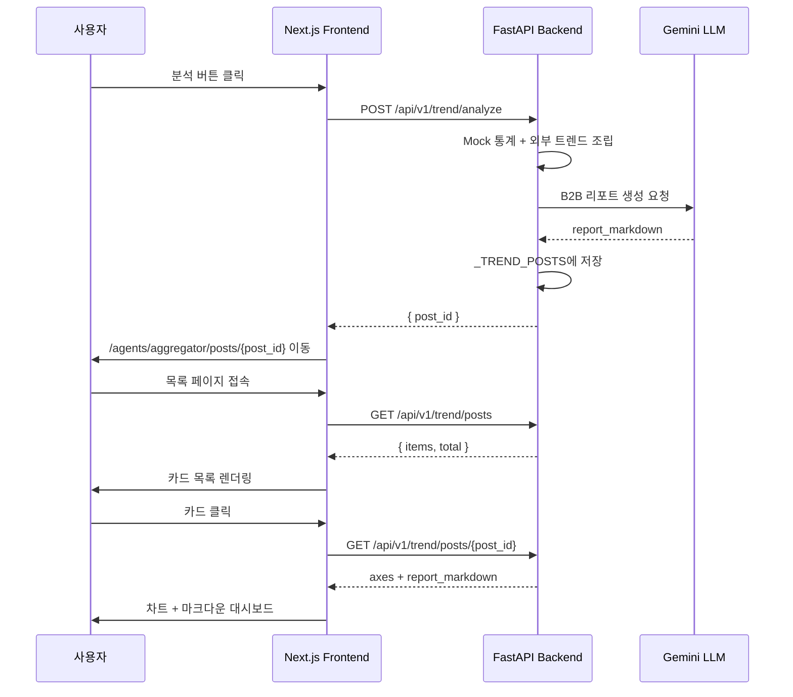

# Aggregator 트렌드 분석 프론트엔드 대시보드 개발 문서

> **작성 목적:** Synapse Platform 프로젝트를 처음 접하는 개발자·기획자가, 이번에 추가된 **Aggregator 트렌드 분석 UI(Next.js)** 와 연동된 **백엔드 게시판 API**의 배경·구조·사용법을 이해할 수 있도록 정리한 문서입니다.  
> **브랜치:** `feature/aggregator`  
> **관련 선행 문서:** [`aggregator-agent-mvp.md`](./aggregator-agent-mvp.md), [`b2b-pdf-and-trend-board.md`](./b2b-pdf-and-trend-board.md), [`trend-analysis-external-integration.md`](./trend-analysis-external-integration.md)

---

## 목차

1. [이번 작업 요약](#1-이번-작업-요약)
2. [Synapse Platform이란?](#2-synapse-platform이란)
3. [Aggregator 에이전트란?](#3-aggregator-에이전트란)
4. [전체 사용자 흐름](#4-전체-사용자-흐름)
5. [시스템 아키텍처](#5-시스템-아키텍처)
6. [백엔드 API 명세](#6-백엔드-api-명세)
7. [프론트엔드 구조](#7-프론트엔드-구조)
8. [주요 컴포넌트 설명](#8-주요-컴포넌트-설명)
9. [공통 유틸리티 (routes / api)](#9-공통-유틸리티-routes--api)
10. [8각 인지 성향 차트](#10-8각-인지-성향-차트)
11. [로컬 실행 방법](#11-로컬-실행-방법)
12. [환경 변수](#12-환경-변수)
13. [알려진 제약사항](#13-알려진-제약사항)
14. [트러블슈팅](#14-트러블슈팅)
15. [추가·변경된 파일 목록](#15-추가변경된-파일-목록)

---

## 1. 이번 작업 요약

이번 개발은 **Aggregator 에이전트**의 B2B 트렌드 분석 기능을 **웹 UI로 조작·조회**할 수 있도록 프론트엔드(Next.js)를 구현하고, 게시글 **목록 조회 API**를 백엔드에 보완한 작업입니다.

| 구분 | 내용 |
|------|------|
| **분석 실행 UI** | Aggregator 에이전트 화면에서 「실시간 트렌드 분석 및 리포트 발행」 버튼 |
| **리포트 상세 대시보드** | 8각 인지 차트 + Gemini 마크다운 리포트 + PDF 다운로드 |
| **리포트 목록 페이지** | 발행된 분석 보고서를 카드 목록으로 조회 |
| **API 클라이언트** | `lib/api/trend.ts` — 백엔드 통신·타입 정의 일원화 |
| **백엔드 보완** | `GET /api/v1/trend/posts` 목록 API, CORS 설정 |
| **신규 의존성** | `recharts`, `react-markdown`, `remark-gfm` |

### 구현된 화면 흐름 한눈에 보기

```
[메인 /]
    │
    └─ /agents/aggregator
           ├─ [분석 실행] ──POST /analyze──► post_id 발급
           │                                      │
           │                                      ▼
           │                         /agents/aggregator/posts/{post_id}
           │                         (8각 차트 + 마크다운 리포트 + PDF)
           │
           └─ [발행된 리포트 목록 보기]
                      │
                      ▼
              /agents/aggregator/posts
              (카드 목록 → 상세 페이지 이동)
```

---

## 2. Synapse Platform이란?

Synapse Platform은 **5개의 AI 에이전트**가 사용자의 디지털 데이터를 분석·활용하는 멀티 에이전트 시스템입니다.

| 에이전트 ID | 이름 | 역할 |
|-------------|------|------|
| `aggregator` | Aggregator | 디지털 자아 데이터를 모아 시장 트렌드 분석 |
| `archiver` | Archiver | 의도적 지식 수집·토론 |
| `indexer` | Indexer | 디지털 발자국 기록·정돈 |
| `navigator` | Navigator | 목표 달성 페이스메이킹 |
| `profiler` | Profiler | 사용자 성향·상태 분석 |

프론트엔드는 **Next.js 15 App Router** 기반이며, 백엔드는 **FastAPI**로 구성되어 있습니다.  
이번 작업은 그중 **Aggregator** 에이전트에 집중합니다.

---

## 3. Aggregator 에이전트란?

Aggregator는 다음 데이터를 통합해 **B2B 시장 분석 리포트**를 생성합니다.

1. **내부 사용자 통계 (Mock)** — 비식별 코호트의 키워드·8각 인지 성향 점수
2. **외부 시장 트렌드 (실시간)** — 외부 API에서 수집한 트렌드 데이터
3. **Gemini LLM** — 위 데이터를 바탕으로 마크다운 형식 B2B 리포트 작성

분석 결과는 `post_id` 단위로 **인메모리 게시판**에 저장되며, 프론트엔드에서 목록·상세·PDF 다운로드가 가능합니다.

---

## 4. 전체 사용자 흐름

### 4.1 리포트 발행

1. 사용자가 `http://localhost:3000` 에서 **Aggregator** 카드 선택
2. `/agents/aggregator` 페이지 진입
3. **「실시간 트렌드 분석 및 리포트 발행」** 버튼 클릭
4. 프론트엔드가 `POST /api/v1/trend/analyze` 호출 (로딩 스피너 표시)
5. 백엔드가 통합 데이터 조립 → Gemini 리포트 생성 → `post_id` 반환
6. 프론트엔드가 `/agents/aggregator/posts/{post_id}` 로 자동 이동

### 4.2 리포트 상세 조회

1. 상세 페이지 진입 시 서버 컴포넌트가 `GET /api/v1/trend/posts/{post_id}` 호출
2. 화면 구성:
   - **상단:** 제목, 생성일, PDF 다운로드 버튼
   - **좌측:** 8각 인지 성향 레이더 차트
   - **우측:** Gemini가 생성한 마크다운 B2B 리포트

### 4.3 리포트 목록 조회

1. Aggregator 페이지에서 **「발행된 리포트 목록 보기」** 클릭
2. `/agents/aggregator/posts` 진입
3. 서버 컴포넌트가 `GET /api/v1/trend/posts` 호출
4. 카드 클릭 시 해당 상세 페이지로 이동

---

## 5. 시스템 아키텍처

```
┌─────────────────────────────────────────────────────────────────┐
│                    Next.js Frontend (port 3000)                  │
│  ┌──────────────┐  ┌──────────────┐  ┌────────────────────────┐ │
│  │ Agent Page   │  │ Posts List   │  │ Post Detail Dashboard  │ │
│  │ /agents/     │  │ /agents/     │  │ /agents/.../posts/     │ │
│  │ [slug]       │  │ [slug]/posts │  │ [post_id]              │ │
│  └──────┬───────┘  └──────┬───────┘  └───────────┬────────────┘ │
│         │                 │                       │              │
│         └─────────────────┼───────────────────────┘              │
│                           │                                      │
│              lib/api/trend.ts  (fetch 래퍼)                      │
│              lib/api/config.ts (API Base URL)                    │
└───────────────────────────┼──────────────────────────────────────┘
                            │ HTTP (CORS 허용)
                            ▼
┌─────────────────────────────────────────────────────────────────┐
│                 FastAPI Backend (port 8000)                      │
│                 prefix: /api/v1/trend                            │
│  ┌─────────────┐  ┌──────────────┐  ┌─────────────────────────┐ │
│  │ trend.py    │  │ nodes.py     │  │ services/pdf.py         │ │
│  │ REST API    │─►│ Gemini 리포트│  │ Markdown → PDF 변환     │ │
│  └──────┬──────┘  └──────────────┘  └─────────────────────────┘ │
│         │                                                        │
│         ▼                                                        │
│  _TREND_POSTS (인메모리 dict)                                    │
└─────────────────────────────────────────────────────────────────┘
```

### 서버/클라이언트 컴포넌트 분리

| 영역 | 렌더링 방식 | 이유 |
|------|------------|------|
| `posts/page.tsx`, `posts/[post_id]/page.tsx` | **서버 컴포넌트** | 초기 데이터를 서버에서 fetch |
| `aggregator-analyze-button.tsx` | **클라이언트** (`use client`) | 버튼 클릭, `router.push`, 로딩 상태 |
| `cognitive-chart.tsx` | **클라이언트** | Recharts는 브라우저 DOM 필요 |
| `markdown-report.tsx` | **클라이언트** | react-markdown 렌더링 |
| `trend-post-dashboard.tsx` | **클라이언트** | PDF 다운로드 `window.open` |

---

## 6. 백엔드 API 명세

**Base URL:** `http://localhost:8000/api/v1/trend`

### 6.1 이번 작업에서 프론트엔드가 사용하는 엔드포인트

| Method | Path | 설명 | 응답 |
|--------|------|------|------|
| `POST` | `/analyze` | 트렌드 분석 실행 + 게시글 저장 | `{ "post_id": "..." }` |
| `GET` | `/posts` | 저장된 게시글 목록 (최신순) | `{ "items": [...], "total": N }` |
| `GET` | `/posts/{post_id}` | 게시글 상세 (차트 + 마크다운) | `TrendPostResponse` |
| `GET` | `/posts/{post_id}/download` | PDF 파일 스트리밍 다운로드 | `application/pdf` |

### 6.2 게시글 상세 응답 예시 (`TrendPostResponse`)

```json
{
  "post_id": "b62c5497052d46cc8b0772c454817903",
  "generated_at": "2026-06-09T12:34:56.789000+00:00",
  "cohort_size": 12847,
  "axes": [
    { "key": "intellectual_curiosity", "label": "지적 호기심", "avg_score": 52.3 },
    { "key": "self_improvement", "label": "자기계발", "avg_score": 61.8 }
  ],
  "report_markdown": "# B2B 시장 분석 리포트\n\n..."
}
```

> `axes`는 항상 8개 축이 포함됩니다.

### 6.3 게시글 목록 응답 예시 (`TrendPostListResponse`)

```json
{
  "items": [
    {
      "post_id": "b62c5497052d46cc8b0772c454817903",
      "generated_at": "2026-06-09T12:34:56.789000+00:00",
      "cohort_size": 12847
    }
  ],
  "total": 1
}
```

### 6.4 CORS 설정

프론트엔드(`localhost:3000`)에서 API를 호출할 수 있도록 `backend/app/main.py`에 CORS 미들웨어가 추가되어 있습니다.

```python
allow_origins=[
    "http://localhost:3000",
    "http://127.0.0.1:3000",
]
```

### 6.5 데이터 저장 방식 (인메모리)

게시글은 Python 딕셔너리 `_TREND_POSTS`에 저장됩니다.

- **장점:** DB 없이 빠른 프로토타이핑 가능
- **단점:** 서버(컨테이너) 재시작 시 모든 게시글 소실
- **향후:** PostgreSQL 등 영구 저장소로 교체 예정

---

## 7. 프론트엔드 구조

### 7.1 디렉터리 트리 (이번 작업 관련)

```
frontend/
├── app/
│   └── agents/
│       └── [slug]/
│           ├── page.tsx                    # 에이전트 상세 (aggregator 시 분석 UI)
│           └── posts/
│               ├── page.tsx                  # 리포트 목록
│               └── [post_id]/
│                   └── page.tsx              # 리포트 상세 대시보드
├── components/
│   ├── aggregator/                         # Aggregator 전용 컴포넌트
│   │   ├── aggregator-actions.tsx          # 분석 버튼 + 목록 링크 묶음
│   │   ├── aggregator-analyze-button.tsx   # 분석 실행 버튼
│   │   ├── cognitive-chart.tsx             # 8각 레이더 차트
│   │   ├── markdown-report.tsx             # 마크다운 리포트 렌더러
│   │   ├── trend-post-dashboard.tsx        # 상세 대시보드 레이아웃
│   │   └── trend-post-list.tsx             # 목록 카드 UI
│   ├── agent-detail.tsx                    # 에이전트 공통 상세 레이아웃
│   └── ui/                                 # shadcn/ui (Button, Card 등)
└── lib/
    ├── api/
    │   ├── config.ts                       # API Base URL 설정
    │   └── trend.ts                        # 트렌드 API 클라이언트
    ├── routes/
    │   ├── paths.ts                        # 프론트 라우트 경로 상수
    │   └── index.ts
    └── agents.ts                           # 에이전트 메타데이터
```

### 7.2 페이지별 역할

| URL | 파일 | 설명 |
|-----|------|------|
| `/agents/aggregator` | `app/agents/[slug]/page.tsx` | Aggregator 전용 분석·목록 버튼 표시 |
| `/agents/aggregator/posts` | `app/agents/[slug]/posts/page.tsx` | 발행 리포트 카드 목록 |
| `/agents/aggregator/posts/{id}` | `app/agents/[slug]/posts/[post_id]/page.tsx` | 리포트 상세 대시보드 |

> `posts` 관련 페이지는 현재 `slug === "aggregator"`일 때만 동작합니다. 다른 에이전트 slug로 접근 시 404를 반환합니다.

---

## 8. 주요 컴포넌트 설명

### 8.1 `aggregator-actions.tsx`

Aggregator 에이전트 페이지 하단에 렌더링되는 액션 영역입니다.

- **분석 버튼** (`AggregatorAnalyzeButton`)
- **목록 링크** — `/agents/aggregator/posts`로 이동

### 8.2 `aggregator-analyze-button.tsx`

| 동작 | 설명 |
|------|------|
| 클릭 | `analyzeTrend()` → `POST /analyze` |
| 로딩 | `Loader2` 스피너 + 「분석 중...」 |
| 성공 | `router.push(/agents/{slug}/posts/{post_id})` |
| 실패 | 에러 메시지 표시 |

### 8.3 `cognitive-chart.tsx`

- **라이브러리:** Recharts `RadarChart`
- **데이터:** `ProfileAxis[]` — `key`, `label`, `avg_score`
- **표시:** 8개 축 라벨(지적 호기심, 자기계발 등)이 차트 꼭짓점에 노출
- **부가 정보:** 코호트 인원 수, 호버 툴팁

### 8.4 `markdown-report.tsx`

- **라이브러리:** `react-markdown` + `remark-gfm` (표·체크리스트 등 GFM 지원)
- Gemini가 생성한 B2B 마크다운을 Typography 스타일로 렌더링
- 제목(`h1`~`h3`), 목록, 표, 인용문, 코드 블록 등 커스텀 스타일 적용

### 8.5 `trend-post-dashboard.tsx`

리포트 상세 페이지의 메인 UI입니다.

```
┌─────────────────────────────────────────────────────────┐
│  ← 리포트 목록   에이전트로          [PDF 보고서 다운로드] │
│  시장 인지 성향 분석 보고서                                │
│  생성일: 2026년 6월 9일 ...                              │
├──────────────────┬──────────────────────────────────────┤
│  8각 인지 성향    │  분석 리포트 (마크다운)                 │
│  레이더 차트      │  ...                                  │
│  (CognitiveChart)│  (MarkdownReport)                     │
└──────────────────┴──────────────────────────────────────┘
```

### 8.6 `trend-post-list.tsx`

- 게시글을 카드 목록으로 표시 (생성일, 코호트 수, post_id 앞 8자)
- 빈 목록 시 안내 메시지 + 에이전트로 돌아가기 버튼
- 카드 클릭 → 상세 페이지 이동

---

## 9. 공통 유틸리티 (routes / api)

### 9.1 `lib/routes/paths.ts` — 프론트 페이지 경로

컴포넌트·페이지에서 URL 문자열을 하드코딩하지 않도록 경로를 중앙 관리합니다.

```typescript
export const ROUTES = {
  home: "/",
  agentDetail: (slug) => `/agents/${slug}`,
  trendPosts: (slug) => `/agents/${slug}/posts`,
  trendPost: (slug, postId) => `/agents/${slug}/posts/${postId}`,
};
```

**사용 예:** `<Link href={ROUTES.trendPosts("aggregator")}>`

### 9.2 `lib/api/config.ts` — 백엔드 API 주소

```typescript
export const API_BASE_URL =
  process.env.NEXT_PUBLIC_API_BASE_URL ?? "http://localhost:8000";

export const TREND_API_BASE = `${API_BASE_URL}/api/v1/trend`;
```

### 9.3 `lib/api/trend.ts` — API 클라이언트

| 함수 | 백엔드 | 용도 |
|------|--------|------|
| `analyzeTrend()` | `POST /analyze` | 분석 실행 |
| `fetchTrendPosts()` | `GET /posts` | 목록 조회 |
| `fetchTrendPost(id)` | `GET /posts/{id}` | 상세 조회 |
| `getTrendPostPdfUrl(id)` | `GET /posts/{id}/download` | PDF URL 생성 |

TypeScript 인터페이스(`ProfileAxis`, `TrendPostResponse` 등)도 이 파일에 정의되어 있어, 컴포넌트에서 타입 안전하게 사용할 수 있습니다.

---

## 10. 8각 인지 성향 차트

백엔드 `mock_data.py`와 프론트엔드 차트가 **동일한 8개 축**을 사용합니다.

| # | 라벨 (UI) | key | 의미 |
|---|-----------|-----|------|
| 1 | 지적 호기심 | `intellectual_curiosity` | 깊은 탐구·지식 탐색 성향 |
| 2 | 자기계발 | `self_improvement` | 성장·학습 지향 |
| 3 | 사회·시선 | `social_awareness` | 사회적 관심·트렌드 민감도 |
| 4 | 깊이·몰입 | `depth_immersion` | 장시간 몰입·전문성 추구 |
| 5 | 실용 지향 | `practical_orientation` | 실생활·업무 활용 중시 |
| 6 | 정서·위로 | `emotional_comfort` | 감정적 안정·위로 콘텐츠 |
| 7 | 창의·표현 | `creative_expression` | 창작·자기표현 욕구 |
| 8 | 오락·해방 | `entertainment_release` | 가벼운 오락·스트레스 해소 |

점수 범위: **0 ~ 100** (높을수록 해당 성향이 강함)

---

## 11. 로컬 실행 방법

### 11.1 백엔드 (Docker 권장)

```bash
cd backend
docker build -t synapse-backend .
docker run --rm -p 8000:8000 --env-file .env synapse-backend
```

- Swagger UI: http://localhost:8000/docs
- Health check: http://localhost:8000/health

### 11.2 프론트엔드

```bash
cd frontend
pnpm install
pnpm dev
```

- 접속: http://localhost:3000
- Aggregator: http://localhost:3000/agents/aggregator
- 리포트 목록: http://localhost:3000/agents/aggregator/posts

### 11.3 전체 테스트 시나리오

1. 백엔드·프론트엔드 모두 실행
2. `/agents/aggregator` → **분석 실행** (Gemini API 키 필요, 30초~1분 소요 가능)
3. 자동 이동된 상세 페이지에서 차트·리포트·PDF 확인
4. **리포트 목록**으로 이동해 방금 생성한 게시글 확인

---

## 12. 환경 변수

### 백엔드 (`backend/.env`)

| 변수 | 설명 |
|------|------|
| `GOOGLE_API_KEY` | Gemini API 키 (리포트 생성에 필수) |

### 프론트엔드 (`frontend/.env.local`, 선택)

| 변수 | 기본값 | 설명 |
|------|--------|------|
| `NEXT_PUBLIC_API_BASE_URL` | `http://localhost:8000` | 백엔드 API 주소 |

---

## 13. 알려진 제약사항

| 항목 | 내용 |
|------|------|
| **인메모리 저장** | 서버 재시작 시 게시글 전부 삭제 |
| **DB 미연동** | 영구 저장·다중 인스턴스 공유 불가 |
| **Aggregator 전용** | `posts` 페이지는 `aggregator` slug만 지원 |
| **Gemini 의존** | API 키 없거나 모델 오류 시 분석 실패 |
| **PDF (WeasyPrint)** | Windows 네이티브 실행 시 의존성 이슈 가능 → Docker 권장 |
| **구 컴포넌트 파일** | `components/` 루트에 이전 경로 파일이 남아 있을 수 있음 → `components/aggregator/`로 통합 후 삭제 권장 |

---

## 14. 트러블슈팅

### Q. 목록이 비어 있는데 분석은 성공했다

**원인 1:** Docker 이미지가 옛 버전이라 `GET /posts` API가 없음 (404)

```bash
# OpenAPI에 /api/v1/trend/posts 가 있는지 확인
curl http://localhost:8000/openapi.json
```

없으면 이미지 재빌드 후 컨테이너 재시작:

```bash
docker build -t synapse-backend ./backend
docker run --rm -p 8000:8000 --env-file .env synapse-backend
```

**원인 2:** 분석 후 Docker를 재시작해 인메모리 데이터가 초기화됨 → 분석을 다시 실행

**원인 3:** 프론트엔드가 API 오류를 빈 목록으로 처리 (개선됨) → 화면에 빨간 에러 박스가 표시되는지 확인

### Q. 분석 버튼 클릭 시 CORS 오류

`backend/app/main.py`의 CORS `allow_origins`에 프론트 주소가 포함되어 있는지 확인

### Q. 상세는 되는데 목록만 안 됨

대부분 **목록 API 미배포** 문제입니다. 위 Docker 재빌드 절차를 따르세요.

### Q. `gemini-1.5-flash` NOT_FOUND 오류

Gemini 모델명이 변경되었을 수 있습니다. `backend/app/agents/aggregator/nodes.py`의 모델 설정을 확인하세요.

---

## 15. 추가·변경된 파일 목록

### 백엔드

| 파일 | 변경 내용 |
|------|-----------|
| `app/api/v1/trend.py` | `GET /posts` 목록 API 추가 |
| `app/schemas/trend.py` | `TrendPostSummarySchema`, `TrendPostListResponse` 추가 |
| `app/main.py` | CORS 미들웨어 추가 |
| `app/agents/aggregator/nodes.py` | Gemini 모델 관련 수정 |

### 프론트엔드 — 페이지

| 파일 | 설명 |
|------|------|
| `app/agents/[slug]/page.tsx` | Aggregator 분석·목록 액션 연결 |
| `app/agents/[slug]/posts/page.tsx` | 리포트 목록 페이지 (신규) |
| `app/agents/[slug]/posts/[post_id]/page.tsx` | 리포트 상세 페이지 (신규) |

### 프론트엔드 — 컴포넌트

| 파일 | 설명 |
|------|------|
| `components/aggregator/aggregator-actions.tsx` | 분석 + 목록 링크 |
| `components/aggregator/aggregator-analyze-button.tsx` | 분석 실행 버튼 |
| `components/aggregator/cognitive-chart.tsx` | 8각 레이더 차트 |
| `components/aggregator/markdown-report.tsx` | 마크다운 렌더러 |
| `components/aggregator/trend-post-dashboard.tsx` | 상세 대시보드 |
| `components/aggregator/trend-post-list.tsx` | 목록 카드 |
| `components/agent-detail.tsx` | `action` prop 추가 |

### 프론트엔드 — 라이브러리

| 파일 | 설명 |
|------|------|
| `lib/api/config.ts` | API Base URL |
| `lib/api/trend.ts` | 트렌드 API 클라이언트·타입 |
| `lib/routes/paths.ts` | `trendPosts`, `trendPost` 경로 추가 |
| `package.json` | `recharts`, `react-markdown`, `remark-gfm` 추가 |

---

## 부록: API 호출 시퀀스 다이어그램


