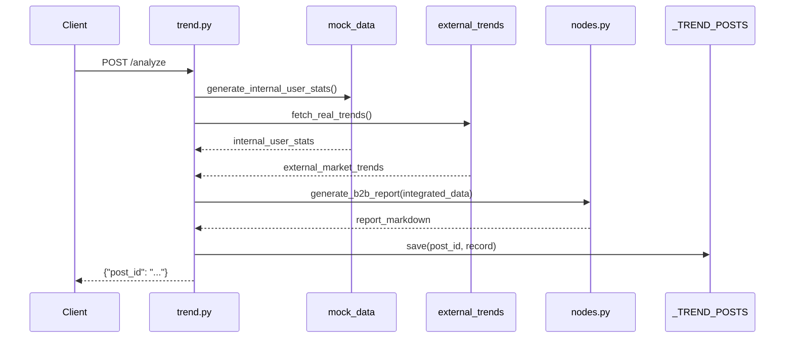
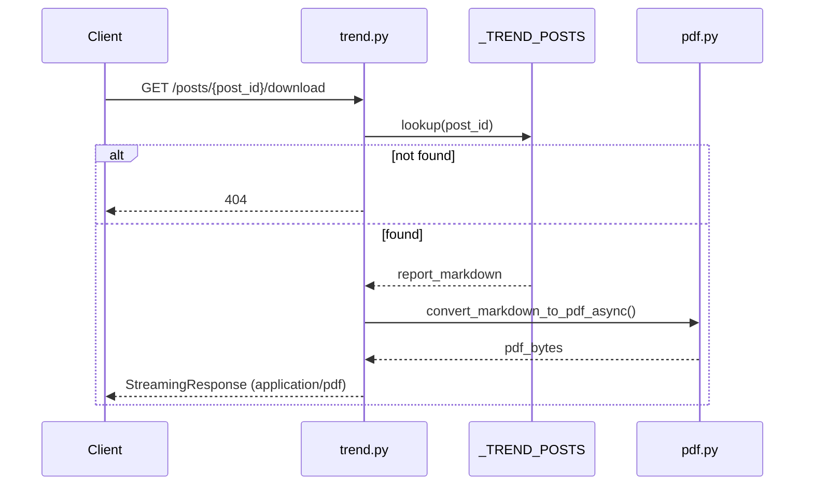

# B2B PDF 리포트 & 트렌드 게시판 API 개발 문서

> **작성 목적:** Synapse Platform 프로젝트를 처음 접하는 개발자·기획자가, 이번에 추가된 **B2B PDF 자동 생성**, **Docker 배포 환경**, **인메모리 트렌드 게시판 API**의 배경·구조·사용법을 이해할 수 있도록 정리한 문서입니다.  
> **브랜치:** `feature/aggregator`  
> **관련 선행 문서:** [`aggregator-agent-mvp.md`](./aggregator-agent-mvp.md), [`trend-analysis-external-integration.md`](./trend-analysis-external-integration.md)

---

## 목차

1. [이번 작업 요약](#1-이번-작업-요약)
2. [왜 이 기능이 필요한가?](#2-왜-이-기능이-필요한가)
3. [전체 아키텍처](#3-전체-아키텍처)
4. [추가·변경된 파일 목록](#4-추가변경된-파일-목록)
5. [PDF 변환 모듈 (`app/services/pdf.py`)](#5-pdf-변환-모듈-appservicespdfpy)
6. [트렌드 API 확장 (`app/api/v1/trend.py`)](#6-트렌드-api-확장-appapiv1trendpy)
7. [API 스키마 (`app/schemas/trend.py`)](#7-api-스키마-appschemastrendpy)
8. [REST API 전체 명세](#8-rest-api-전체-명세)
9. [Docker 배포 (`backend/Dockerfile`)](#9-docker-배포-backenddockerfile)
10. [환경 변수](#10-환경-변수)
11. [로컬 실행 방법](#11-로컬-실행-방법)
12. [Docker 실행 방법](#12-docker-실행-방법)
13. [API 사용 예시 (curl)](#13-api-사용-예시-curl)
14. [데이터 흐름 다이어그램](#14-데이터-흐름-다이어그램)
15. [알려진 제약사항 및 향후 개선](#15-알려진-제약사항-및-향후-개선)

---

## 1. 이번 작업 요약

이번 개발은 **Aggregator 에이전트**가 생성하는 B2B 트렌드 분석 리포트를, 기업 고객이 **즉시 PDF로 다운로드**하고 **게시글 단위로 조회**할 수 있도록 백엔드를 확장한 작업입니다.

| 구분 | 내용 |
|------|------|
| **PDF 변환** | Gemini가 생성한 Markdown → 출판물 수준 PDF (WeasyPrint + CSS Paged Media) |
| **게시판 API** | 분석 결과를 `post_id`로 저장·조회하는 인메모리 REST API |
| **Docker** | WeasyPrint 네이티브 의존성 포함 Linux 컨테이너 이미지 |
| **의존성 추가** | `markdown`, `weasyprint` |

### 구현된 기능 한눈에 보기

```
[클라이언트]
    │
    ├─ POST /analyze          → 분석 실행 + post_id 발급
    ├─ GET  /posts/{id}       → 저장된 분석 결과 조회
    ├─ GET  /posts/{id}/download → 저장된 본문 PDF 다운로드
    │
    ├─ GET  /dashboard        → (기존) 키워드 + 리포트 즉시 조회
    ├─ GET  /graph            → (기존) 8각 인지 성향 차트 데이터
    └─ GET  /download-pdf     → (기존) 최신 리포트 즉시 PDF 다운로드
```

---

## 2. 왜 이 기능이 필요한가?

### 2.1 B2B 리포트의 PDF 필요성

Aggregator 에이전트는 내부 사용자 통계와 외부 시장 트렌드를 통합해 **Gemini LLM**으로 Markdown 형식의 시장 분석 리포트를 생성합니다. 그러나 Markdown 텍스트만으로는:

- 기업 고객이 **내부 보고서·프레젠테이션**에 바로 활용하기 어렵고
- **브랜드 일관된 레이아웃**(표, 제목, 페이지 여백 등)을 보장하기 어렵습니다.

따라서 서버에서 Markdown → PDF 변환 파이프라인을 구축해, **다운로드 즉시 사용 가능한 B2B 보고서**를 제공합니다.

### 2.2 WeasyPrint를 선택한 이유 (Option 2)

PDF 생성 방식은 크게 두 가지로 검토되었습니다.

| 방식 | 장점 | 단점 |
|------|------|------|
| **Option 1:** ReportLab 등 프로그래밍 방식 | 세밀한 좌표 제어 | Markdown 구조를 일일이 파싱·매핑해야 함 |
| **Option 2:** Markdown → HTML → WeasyPrint | CSS Paged Media로 출판물 수준 레이아웃, Markdown 그대로 활용 | Linux 네이티브 라이브러리(Pango, Cairo) 필요 |

**Option 2**를 채택했습니다. Gemini가 출력하는 Markdown(표, 코드 블록, 제목 계층)을 `markdown` 패키지로 HTML로 변환한 뒤, WeasyPrint가 CSS를 적용해 A4 PDF로 렌더링합니다.

### 2.3 인메모리 게시판 API 필요성

기존 `/dashboard`, `/download-pdf` 엔드포인트는 **요청할 때마다** Gemini를 호출해 새 리포트를 생성합니다. 이 방식은:

- API 호출 비용·시간이 매번 발생하고
- 한 번 생성한 리포트를 **나중에 다시 조회**할 수 없습니다.

`POST /analyze` → `GET /posts/{post_id}` 패턴으로, 분석 결과를 **`post_id` 단위로 저장·재조회**할 수 있게 했습니다. (현재는 인메모리 저장이며, DB 연동은 향후 작업입니다.)

### 2.4 Docker가 필요한 이유

WeasyPrint는 **Pango, Cairo, GDK-Pixbuf** 등 시스템 라이브러리에 의존합니다. Windows 로컬 환경에서는 `libgobject-2.0-0` 등 네이티브 DLL이 없어 import 자체가 실패할 수 있습니다. **Linux Docker 컨테이너**에서 실행하면 의존성을 일관되게 제공할 수 있습니다.

---

## 3. 전체 아키텍처

```
┌──────────────────────────────────────────────────────────────────────┐
│                         FastAPI (app/main.py)                        │
│                    prefix: /api/v1/trend                             │
└───────────────────────────────┬──────────────────────────────────────┘
                                │
        ┌───────────────────────┼───────────────────────┐
        ▼                       ▼                       ▼
┌───────────────┐     ┌─────────────────┐     ┌─────────────────┐
│ mock_data.py  │     │ external_trends │     │  nodes.py       │
│ (내부 Mock    │     │ .py             │     │  (Gemini LLM)   │
│  사용자 통계)  │     │ (Google/YouTube │     │                 │
│               │     │  /Naver RSS)    │     │                 │
└───────┬───────┘     └────────┬────────┘     └────────┬────────┘
        │                      │                       │
        └──────────────────────┼───────────────────────┘
                               ▼
                    ┌─────────────────────┐
                    │  IntegratedData     │
                    │  (통합 데이터 조립)   │
                    └──────────┬──────────┘
                               │
              ┌────────────────┼────────────────┐
              ▼                ▼                ▼
     ┌─────────────┐  ┌──────────────┐  ┌──────────────┐
     │ report_     │  │ 8각 축 점수   │  │ _TREND_POSTS │
     │ markdown    │  │ (axes)       │  │ (인메모리     │
     │ (Gemini 출력)│  │              │  │  게시판)     │
     └──────┬──────┘  └──────────────┘  └──────────────┘
            │
            ▼
     ┌─────────────┐
     │  pdf.py     │
     │ Markdown →  │
     │ HTML → PDF  │
     │ (WeasyPrint)│
     └─────────────┘
```

### 레이어 구조

| 레이어 | 역할 | 이번 작업에서 추가·변경된 파일 |
|--------|------|-------------------------------|
| **API** | HTTP 엔드포인트, 요청/응답 | `app/api/v1/trend.py` |
| **Schema** | Pydantic 요청·응답 모델 | `app/schemas/trend.py` |
| **Service** | PDF 변환 비즈니스 로직 | `app/services/pdf.py` (신규) |
| **Agent** | Gemini 리포트 생성 | `app/agents/aggregator/nodes.py` (기존, 변경 없음) |
| **Infra** | Docker 이미지 | `backend/Dockerfile`, `backend/.dockerignore` |

---

## 4. 추가·변경된 파일 목록

| 파일 | 상태 | 설명 |
|------|------|------|
| `backend/app/services/pdf.py` | **신규** | Markdown → PDF 변환 서비스 |
| `backend/app/api/v1/trend.py` | **수정** | 게시판 API 3종 + 기존 엔드포인트 유지 |
| `backend/app/schemas/trend.py` | **수정** | `AnalyzeResponse`, `TrendPostResponse` 추가 |
| `backend/pyproject.toml` | **수정** | `markdown`, `weasyprint` 의존성 |
| `backend/uv.lock` | **수정** | lockfile 갱신 |
| `backend/Dockerfile` | **신규** | WeasyPrint + uv 기반 컨테이너 |
| `backend/.dockerignore` | **신규** | `.venv`, `.env` 등 빌드 제외 |

---

## 5. PDF 변환 모듈 (`app/services/pdf.py`)

### 5.1 역할

Gemini가 생성한 **Markdown 문자열**을 받아, B2B 보고서 스타일이 적용된 **PDF 바이너리(`bytes`)** 를 반환합니다.

### 5.2 변환 파이프라인

```
Markdown 텍스트
    │
    ▼  markdown.markdown(extensions=['tables', 'fenced_code'])
HTML 본문 (<h1>, <table>, <pre> 등)
    │
    ▼  _HTML_TEMPLATE + _PDF_CSS 로 완전한 HTML 문서 조립
<!DOCTYPE html><html>…<style>…</style><body>…</body></html>
    │
    ▼  weasyprint.HTML(string=full_html).write_pdf()
PDF 바이너리 (bytes)
```

### 5.3 공개 함수

| 함수 | 타입 | 설명 |
|------|------|------|
| `convert_markdown_to_pdf(markdown_text: str) -> bytes` | 동기 | PDF 변환 핵심 로직. WeasyPrint는 CPU 바운드·블로킹 작업 |
| `convert_markdown_to_pdf_async(markdown_text: str) -> bytes` | 비동기 | `asyncio.run_in_executor`로 스레드 풀에서 동기 함수 실행. FastAPI 이벤트 루프 차단 방지 |

FastAPI 엔드포인트에서는 **항상 `_async` 버전**을 사용합니다.

### 5.4 PDF 스타일링 규칙 (WeasyPrint CSS)

WeasyPrint는 브라우저와 CSS 지원 범위가 다릅니다. `flex`/`grid` 대신 **블록·테이블 레이아웃**을 사용합니다.

| 요소 | CSS 규칙 |
|------|----------|
| **페이지** | A4, 여백 20mm(상하) / 15mm(좌우), 하단 페이지 번호 |
| **본문** | 10.5pt, line-height 1.45, 색상 `#2d3748` (다크 그레이) |
| **제목 h1~h3** | 네이비 톤 `#1a365d`, `#2b6cb0`, `page-break-after: avoid` (고아 제목 방지) |
| **표** | 9.5pt, 헤더 행 `#1a365d` 배경 + 흰 글씨, 제브라 스트라이프 |
| **코드 블록** | `page-break-inside: avoid`, 다크 배경 |
| **전역** | `box-sizing: border-box` |

한글 렌더링을 위해 Docker 이미지에 `fonts-noto-cjk` 패키지가 포함되어 있습니다.

### 5.5 의존성 설치

```bash
cd backend
uv add markdown weasyprint
```

---

## 6. 트렌드 API 확장 (`app/api/v1/trend.py`)

### 6.1 인메모리 게시판 저장소

```python
_TREND_POSTS: dict[str, TrendPostRecord] = {}
```

서버 프로세스 메모리에 `post_id → 게시글` 형태로 저장합니다.

**`TrendPostRecord` 구조:**

| 필드 | 타입 | 설명 |
|------|------|------|
| `post_id` | `str` | UUID hex (32자, 고유 ID) |
| `generated_at` | `str` | ISO 8601 UTC 타임스탬프 |
| `cohort_size` | `int` | 분석 대상 코호트 규모 |
| `axes` | `list[ProfileAxisScore]` | 8각 인지 성향 점수 (Profiler 공통 스키마) |
| `report_markdown` | `str` | Gemini가 생성한 Markdown 리포트 본문 |

> **주의:** 서버 재시작 시 `_TREND_POSTS`는 **완전히 초기화**됩니다. 영구 저장이 필요하면 PostgreSQL 등 DB 연동이 필요합니다.

### 6.2 분석 생성 흐름 (`_create_trend_post`)

1. `get_integrated_data()` — 내부 Mock + 외부 트렌드 조립
2. `generate_b2b_report(data)` — Gemini LLM 호출
3. `uuid.uuid4().hex`로 `post_id` 생성
4. 8각 축 점수·마크다운·생성 시간을 레코드로 묶어 반환

### 6.3 헬퍼 함수

| 함수 | 설명 |
|------|------|
| `_get_post_or_404(post_id)` | 저장소 조회, 없으면 HTTP 404 |
| `_to_post_response(post)` | `TrendPostRecord` → Pydantic `TrendPostResponse` 변환 |

---

## 7. API 스키마 (`app/schemas/trend.py`)

### 기존 스키마 (변경 없음)

| 스키마 | 용도 |
|--------|------|
| `KeywordStatSchema` | 키워드, 빈도, 트렌드 변화율 |
| `ProfileAxisSchema` | 8각 축 key, label, avg_score |
| `DashboardResponse` | 대시보드 응답 |
| `GraphViewResponse` | 8각 차트 응답 |

### 신규 스키마

**`AnalyzeResponse`** — `POST /analyze` 응답

```json
{
  "post_id": "a1b2c3d4e5f6..."
}
```

**`TrendPostResponse`** — `GET /posts/{post_id}` 응답

```json
{
  "post_id": "a1b2c3d4e5f6...",
  "generated_at": "2026-06-09T12:34:56+00:00",
  "cohort_size": 15200,
  "axes": [
    { "key": "intellectual_curiosity", "label": "지적 호기심", "avg_score": 58.3 },
    ...
  ],
  "report_markdown": "# B2B 시장 트렌드 분석\n\n..."
}
```

---

## 8. REST API 전체 명세

**Base URL:** `http://localhost:8000/api/v1/trend`

### 8.1 신규 엔드포인트

#### `POST /analyze`

트렌드 분석을 실행하고 결과를 인메모리에 저장합니다.

| 항목 | 값 |
|------|-----|
| **Method** | POST |
| **Status** | 201 Created |
| **Request Body** | 없음 |
| **Response** | `AnalyzeResponse` |

내부 동작: Mock 데이터 + 외부 트렌드 조립 → Gemini 리포트 생성 → `_TREND_POSTS` 저장

---

#### `GET /posts/{post_id}`

저장된 분석 게시글을 조회합니다.

| 항목 | 값 |
|------|-----|
| **Method** | GET |
| **Path Param** | `post_id` (UUID hex) |
| **Response** | `TrendPostResponse` |
| **Error** | 404 — 존재하지 않는 post_id |

---

#### `GET /posts/{post_id}/download`

저장된 Markdown을 PDF로 변환해 스트리밍 다운로드합니다.

| 항목 | 값 |
|------|-----|
| **Method** | GET |
| **Path Param** | `post_id` |
| **Response** | `application/pdf` (StreamingResponse) |
| **파일명** | `B2B_Trend_Report_{post_id 앞 8자}_{YYYYMMDD}.pdf` |
| **Error** | 404 — 존재하지 않는 post_id |

---

### 8.2 기존 엔드포인트 (유지)

| Method | Path | 설명 |
|--------|------|------|
| GET | `/dashboard` | 키워드 Top 10 + Gemini 리포트 (매 요청마다 새로 생성) |
| GET | `/graph` | 8각 인지 성향 차트 데이터 |
| GET | `/download-pdf` | 최신 Gemini 리포트 즉시 PDF 다운로드 (게시판 미사용) |

### 8.3 엔드포인트 비교: `/download-pdf` vs `/posts/{id}/download`

| | `/download-pdf` | `/posts/{post_id}/download` |
|--|-----------------|-------------------------------|
| Gemini 호출 | **매번** 새로 호출 | **저장된** 마크다운 사용 |
| post_id 필요 | ❌ | ✅ |
| 용도 | 즉석 최신 리포트 | 과거 분석 결과 재다운로드 |

---

## 9. Docker 배포 (`backend/Dockerfile`)

### 9.1 이미지 구성

| 항목 | 값 |
|------|-----|
| 베이스 | `python:3.12-slim-bookworm` (Debian 12) |
| 패키지 관리 | [uv](https://github.com/astral-sh/uv) |
| 포트 | 8000 |
| 실행 명령 | `uv run uvicorn app.main:app --host 0.0.0.0 --port 8000` |

### 9.2 WeasyPrint 시스템 패키지

Dockerfile `RUN apt-get install` 단계에서 설치:

- `libcairo2`, `libpango-1.0-0`, `libpangocairo-1.0-0`, `libpangoft2-1.0-0`
- `libharfbuzz-subset0`, `libgdk-pixbuf-2.0-0`, `libffi8`
- `shared-mime-info`
- `fonts-noto-cjk` (한글 PDF 폰트)

### 9.3 `.dockerignore`

빌드 컨텍스트에서 제외:

- `.venv`, `.env`, `__pycache__`, `.ruff_cache`, `.git`

`.env`는 **이미지에 포함되지 않으며**, 실행 시 `--env-file`로 주입합니다.

---

## 10. 환경 변수

`backend/.env` 파일 예시:

```env
GOOGLE_API_KEY=your_gemini_api_key
# 또는
GEMINI_API_KEY=your_gemini_api_key

# 선택 (외부 트렌드 API)
YOUTUBE_API_KEY=...
NAVER_CLIENT_ID=...
NAVER_CLIENT_SECRET=...

# 선택 (Gemini 모델 오버라이드, 기본: gemini-2.5-flash)
GEMINI_MODEL=gemini-2.5-flash
```

| 변수 | 필수 | 설명 |
|------|------|------|
| `GOOGLE_API_KEY` 또는 `GEMINI_API_KEY` | **Gemini 호출 시 필수** | PDF만 테스트할 경우 불필요 |
| `YOUTUBE_API_KEY` | 선택 | 없으면 YouTube 트렌드 fallback 데이터 사용 |
| `NAVER_CLIENT_ID`, `NAVER_CLIENT_SECRET` | 선택 | 없으면 Naver fallback 사용 |

---

## 11. 로컬 실행 방법

### Windows (WeasyPrint 제한)

Windows에서는 WeasyPrint 네이티브 라이브러리 부재로 **PDF 변환이 실패**할 수 있습니다. PDF 기능 테스트는 **Docker 사용을 권장**합니다.

API 서버 자체(Gemini 제외)는 로컬에서 실행 가능:

```powershell
cd backend
uv sync
uv run uvicorn app.main:app --reload --port 8000
```

Swagger UI: http://localhost:8000/docs

---

## 12. Docker 실행 방법

### 이미지 빌드

**`backend` 폴더 안에서:**
```powershell
cd backend
docker build -t synapse-backend .
```

**프로젝트 루트에서:**
```powershell
docker build -t synapse-backend ./backend
```

> ⚠️ `backend` 폴더 안에서 `docker build ./backend`를 실행하면 `./backend` 경로가 없어 실패합니다. 현재 디렉터리 기준으로 `.` 또는 루트에서 `./backend`를 사용하세요.

### 컨테이너 실행

```powershell
docker run --rm -p 8000:8000 --env-file .env synapse-backend
```

### 헬스체크

```powershell
curl http://localhost:8000/health
# {"status":"ok"}
```

---

## 13. API 사용 예시 (curl)

### Step 1: 분석 생성

```bash
curl -X POST http://localhost:8000/api/v1/trend/analyze
```

응답 예:
```json
{"post_id":"f3a8b2c1d4e5f6a7b8c9d0e1f2a3b4c5"}
```

### Step 2: 게시글 조회

```bash
curl http://localhost:8000/api/v1/trend/posts/f3a8b2c1d4e5f6a7b8c9d0e1f2a3b4c5
```

### Step 3: PDF 다운로드

```bash
curl -OJ http://localhost:8000/api/v1/trend/posts/f3a8b2c1d4e5f6a7b8c9d0e1f2a3b4c5/download
```

PowerShell:
```powershell
Invoke-WebRequest -Uri "http://localhost:8000/api/v1/trend/posts/{post_id}/download" -OutFile "report.pdf"
```

### 기존 엔드포인트

```bash
# 대시보드
curl http://localhost:8000/api/v1/trend/dashboard

# 8각 차트
curl http://localhost:8000/api/v1/trend/graph

# 즉석 PDF (게시판 미사용)
curl -OJ http://localhost:8000/api/v1/trend/download-pdf
```

---

## 14. 데이터 흐름 다이어그램

### POST /analyze 전체 흐름



### GET /posts/{post_id}/download 흐름



---

## 15. 알려진 제약사항 및 향후 개선

### 현재 제약사항

| 항목 | 설명 |
|------|------|
| **인메모리 저장** | 서버 재시작 시 게시글 소실. 다중 인스턴스 간 공유 불가 |
| **Windows PDF** | WeasyPrint 네이티브 DLL 미설치 시 로컬 PDF 변환 불가 → Docker 권장 |
| **Gemini 비용** | `/analyze`, `/dashboard`, `/download-pdf` 호출 시 LLM API 비용 발생 |
| **동시성** | `_TREND_POSTS` dict는 단일 프로세스용. 멀티 워커(uvicorn workers > 1) 시 저장소 분리 |

### 향후 개선 제안

1. **PostgreSQL / Redis** — 게시글 영구 저장 및 다중 인스턴스 공유
2. **docker-compose.yaml** — backend + DB 통합 오케스트레이션
3. **PDF 캐싱** — 동일 post_id PDF 재요청 시 변환 결과 캐시
4. **GET /posts** — 게시글 목록(페이지네이션) API
5. **인증/권한** — B2B 고객별 리포트 접근 제어
6. **프론트엔드** — 분석 실행 버튼, PDF 다운로드 UI, 8각 차트 시각화

---

## 부록: 커밋 대상 파일 체크리스트

커밋 시 포함할 파일:

```
backend/app/services/pdf.py          # 신규
backend/app/api/v1/trend.py          # 수정
backend/app/schemas/trend.py         # 수정
backend/pyproject.toml               # 수정
backend/uv.lock                      # 수정
backend/Dockerfile                   # 신규
backend/.dockerignore                # 신규
docs/b2b-pdf-and-trend-board.md      # 신규 (본 문서)
```

커밋에서 **제외**할 파일:

```
backend/.env                         # API 키 등 비밀 정보
backend/.venv/                       # 가상환경
backend/__pycache__/                 # 캐시
```
