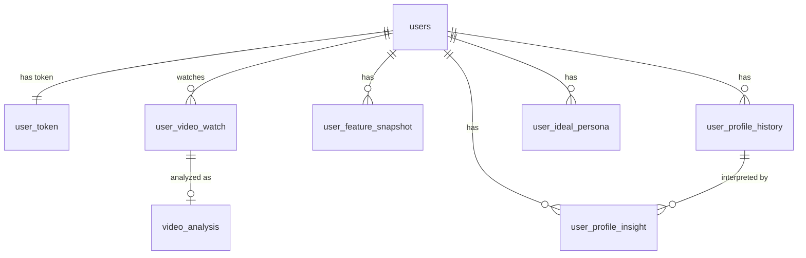

# Synapse ERD

> **DB**: PostgreSQL (확장: `pgvector`, `pgcrypto`)

## 공통 규칙

| 항목 | 규칙 |
|---|---|
| PK | 컬럼명 `id`, 타입 `UUID`, `DEFAULT gen_random_uuid()` |
| FK | 컬럼명 `{참조테이블}_id`, 타입 `UUID`, `REFERENCES` 제약 명시 |
| 시각 | 전부 `TIMESTAMPTZ` (`DEFAULT now()`) |
| 반정형 | `JSONB` |
| 임베딩 | `VECTOR(1536)` + HNSW 인덱스 |

- 기존 `video_vectors` 테이블은 폐기하고 `user_video_watch` + `video_analysis`로 대체.
- `users.id`는 `SERIAL → UUID` 마이그레이션 전제 (FK 타입 일치). JWT/`UserResponse.id`도 `int → UUID`.
- `updated_at`은 `DEFAULT now()`로 INSERT 시점만 기록됨. UPDATE 시 갱신하려면 트리거 또는 앱(`onupdate`)에서 처리.

```sql
CREATE EXTENSION IF NOT EXISTS vector;     -- pgvector
CREATE EXTENSION IF NOT EXISTS pgcrypto;   -- gen_random_uuid()
```

---

## 관계 다이어그램



**파이프라인 흐름**

```
user_video_watch  →  video_analysis  →  user_feature_snapshot
   (원천 로그)         (의미 분석)          (집계 feature)
                                              ↓
user_ideal_persona  ←  user_profile_insight  ←  user_profile_history
   (목표 자아)            (LLM 해석)              (성향 누적)
```

**컴포넌트별 소유 테이블**

| 컴포넌트 | 담당 테이블 |
|---|---|
| 인덱서 (Indexer) | `user_video_watch`, `user_feature_snapshot` |
| 프로파일러 (Profiler) | `video_analysis`, `user_profile_history`, `user_profile_insight` |
| 네비게이터 (Navigator) | `user_ideal_persona` |
| 공통 (Auth) | `users`, `user_token` |

---

## 0. users — 사용자

```sql
CREATE TABLE users (
    id                  UUID         PRIMARY KEY DEFAULT gen_random_uuid(),
    email               VARCHAR(255) NOT NULL UNIQUE,           -- 유저 이메일 (구글 제공)
    google_sub_id       VARCHAR(255) NOT NULL UNIQUE,           -- 구글 OAuth 불변 ID(sub)
    name                VARCHAR(256) NOT NULL,                  -- 표시 이름
    picture             TEXT,                                   -- 프로필 이미지 URL
    access_token        TEXT,                                   -- 구글 access token (Drive/YouTube API용)

    analysis_interval   VARCHAR(50)  NOT NULL DEFAULT 'WEEKLY', -- 분석 주기 (DAILY/WEEKLY/BIWEEKLY)
    next_analysis_at    TIMESTAMPTZ  NOT NULL DEFAULT now(),    -- 다음 분석 예정 일시
    created_at          TIMESTAMPTZ  NOT NULL DEFAULT now()     -- 서비스 가입일
);

CREATE INDEX ix_users_next_analysis ON users (next_analysis_at);  -- 스케줄러 폴링용
```

> refresh_token은 `user_token` 테이블로 분리. 코드 변경: `google_id → google_sub_id` 리네임 (`models/user.py`, `api/v1/auth.py`).

---

## 0-1. user_token — 토큰 관리 (1:1)

```sql
CREATE TABLE user_token (
    id                      UUID         PRIMARY KEY DEFAULT gen_random_uuid(),
    user_id                 UUID         NOT NULL UNIQUE
                                         REFERENCES users(id) ON DELETE CASCADE,
    refresh_token           VARCHAR(512) NOT NULL,    -- 암호화된 '서비스 자체' Refresh Token
    google_refresh_token    VARCHAR(512),             -- 구글 API 접근용 Refresh Token
    expires_at              TIMESTAMPTZ  NOT NULL,     -- (서비스) refresh token 만료 일시
    created_at              TIMESTAMPTZ  NOT NULL DEFAULT now(),
    updated_at              TIMESTAMPTZ  NOT NULL DEFAULT now()
);
```

> 토큰은 평문 저장 금지 — 앱 레벨에서 암호화 후 적재. 512자를 넘을 수 있으면 `TEXT`로 변경.
> 멀티 디바이스 세션이 필요해지면 `user_id`의 UNIQUE 제거(1:N) 또는 세션 테이블 분리.

---

## 1. user_video_watch — 원천 시청 로그 (기존 video_vectors 대체) `[인덱서]`

```sql
CREATE TABLE user_video_watch (
    id              UUID        PRIMARY KEY DEFAULT gen_random_uuid(),
    user_id         UUID        NOT NULL REFERENCES users(id) ON DELETE CASCADE,

    platform        VARCHAR(20) NOT NULL,   -- 플랫폼 (YouTube, TikTok 등)
    channel         TEXT        NOT NULL,   -- 채널명/식별자
    channel_url     TEXT,                   -- 채널 URL
    title           TEXT,                   -- 영상 제목
    url             TEXT        NOT NULL,   -- 영상 URL
    watched_at      TIMESTAMPTZ NOT NULL,   -- 시청 시각
    duration        INT,                    -- 영상 길이(초)
    is_shorts       BOOLEAN,                -- 쇼츠 여부 (true=SHORT)
    description     TEXT,                   -- 영상 설명
    tags            JSONB,                  -- 태그 리스트 ["tag1","tag2"]
    category        VARCHAR(50),            -- 카테고리
    thumbnail_url   TEXT,                   -- 썸네일 URL
    transcript      TEXT,                   -- 자막 데이터

    created_at      TIMESTAMPTZ NOT NULL DEFAULT now(),
    updated_at      TIMESTAMPTZ NOT NULL DEFAULT now(),

    UNIQUE (user_id, url)                   -- 동일 영상 중복 적재 방지
);

CREATE INDEX ix_uvw_user_watched ON user_video_watch (user_id, watched_at DESC);
CREATE INDEX ix_uvw_category     ON user_video_watch (category);
```

---

## 2. video_analysis — 영상 의미 분석 (1:1) `[프로파일러]`

```sql
CREATE TABLE video_analysis (
    id                  UUID         PRIMARY KEY DEFAULT gen_random_uuid(),
    user_video_watch_id UUID         NOT NULL UNIQUE
                                     REFERENCES user_video_watch(id) ON DELETE CASCADE,

    summary_kr      TEXT,                       -- 영상 요약(한국어)
    tones           JSONB,                      -- 톤/분위기 ["진지함","유머"]
    intents         JSONB,                      -- 의도 ["정보전달","설득"]
    value_signals   JSONB,                      -- 가치 신호 ["성취","재미","안정"]

    embedding_text  TEXT         NOT NULL,      -- 임베딩 생성용 정리 문장
    embedding       VECTOR(1536) NOT NULL,      -- 임베딩 벡터

    created_at      TIMESTAMPTZ  NOT NULL DEFAULT now(),
    updated_at      TIMESTAMPTZ  NOT NULL DEFAULT now()
);

CREATE INDEX ix_va_embedding ON video_analysis USING hnsw (embedding vector_cosine_ops);
```

---

## 3. user_feature_snapshot — 기간 집계 feature `[인덱서]`

```sql
CREATE TABLE user_feature_snapshot (
    id              UUID        PRIMARY KEY DEFAULT gen_random_uuid(),
    user_id         UUID        NOT NULL REFERENCES users(id) ON DELETE CASCADE,

    analysis_start  TIMESTAMPTZ NOT NULL,   -- 분석 시작 시점
    analysis_end    TIMESTAMPTZ NOT NULL,   -- 분석 종료(기준) 시점

    category_ratio              JSONB,      -- 카테고리 소비 비율 {"education":0.4}
    video_type_ratio            JSONB,      -- 쇼츠 vs 롱폼 {"short":0.7,"long":0.3}
    channel_top5                JSONB,      -- 최다 시청 채널 TOP5
    category_top5               JSONB,      -- 주요 관심 카테고리 TOP5
    category_channel_diversity  JSONB,      -- 카테고리별 채널 다양성(entropy)

    created_at      TIMESTAMPTZ NOT NULL DEFAULT now(),

    UNIQUE (user_id, analysis_start, analysis_end)   -- 동일 기간 스냅샷 중복 방지
);

CREATE INDEX ix_ufs_user_period ON user_feature_snapshot (user_id, analysis_end DESC);
```

---

## 4. user_profile_history — 성향 누적 스냅샷 (Core Truth) `[프로파일러]`

```sql
CREATE TABLE user_profile_history (
    id              UUID        PRIMARY KEY DEFAULT gen_random_uuid(),
    user_id         UUID        NOT NULL REFERENCES users(id) ON DELETE CASCADE,
    snapshot_date   TIMESTAMPTZ NOT NULL,   -- 성향 계산 시점

    -- Schwartz Value (가치관, 10)
    self_direction      FLOAT,  -- 자율성
    stimulation         FLOAT,  -- 자극/도전
    achievement         FLOAT,  -- 성취
    power               FLOAT,  -- 영향력
    security            FLOAT,  -- 안정
    benevolence         FLOAT,  -- 배려
    universalism        FLOAT,  -- 보편성
    hedonism            FLOAT,  -- 즐거움
    conformity          FLOAT,  -- 순응
    tradition           FLOAT,  -- 전통

    -- TCI (기질)
    novelty_seeking     FLOAT,  -- 자극추구
    persistence         FLOAT,  -- 지속성
    self_transcendence  FLOAT,  -- 자기초월

    -- 8축 스파이더 (행동 성향)
    exploration         FLOAT,  -- 탐구성
    analytical          FLOAT,  -- 분석성
    creativity          FLOAT,  -- 창의성
    execution           FLOAT,  -- 실행력
    achievement_drive   FLOAT,  -- 성취욕
    autonomy            FLOAT,  -- 자율성
    sociality           FLOAT,  -- 사회성
    sensitivity         FLOAT,  -- 감수성

    created_at      TIMESTAMPTZ NOT NULL DEFAULT now(),
    updated_at      TIMESTAMPTZ NOT NULL DEFAULT now()
);

CREATE INDEX ix_uph_user_date ON user_profile_history (user_id, snapshot_date DESC);
```

---

## 5. user_profile_insight — LLM 성향 해석 `[프로파일러]`

```sql
CREATE TABLE user_profile_insight (
    id                      UUID         PRIMARY KEY DEFAULT gen_random_uuid(),
    user_id                 UUID         NOT NULL REFERENCES users(id) ON DELETE CASCADE,
    user_profile_history_id UUID         REFERENCES user_profile_history(id) ON DELETE SET NULL,

    summary_text        TEXT         NOT NULL,  -- 전체 성향 해석 요약(LLM)
    persona_label       VARCHAR(100),           -- 페르소나 이름 ("탐구형 분석가")
    behavior_reasoning  TEXT,                   -- 성향 도출 근거 설명
    dominant_traits     JSONB,                  -- 핵심 성향 {"stimulation":0.8}
    supporting_evidence JSONB,                  -- 근거 데이터(영상/카테고리/채널)
    tone_of_user        TEXT,                   -- 사용자 전반 톤

    created_at          TIMESTAMPTZ  NOT NULL DEFAULT now()
);

CREATE INDEX ix_upi_user    ON user_profile_insight (user_id, created_at DESC);
CREATE INDEX ix_upi_history ON user_profile_insight (user_profile_history_id);
```

---

## 6. user_ideal_persona — 사용자 확정 이상 자아 `[네비게이터]`

```sql
CREATE TABLE user_ideal_persona (
    id              UUID        PRIMARY KEY DEFAULT gen_random_uuid(),
    user_id         UUID        NOT NULL REFERENCES users(id) ON DELETE CASCADE,

    -- 목표 8축 (user_profile_history의 8축과 동일 정의)
    exploration         FLOAT,
    analytical          FLOAT,
    creativity          FLOAT,
    execution           FLOAT,
    achievement_drive   FLOAT,
    autonomy            FLOAT,
    sociality           FLOAT,
    sensitivity         FLOAT,

    description     TEXT,                   -- AI가 생성한 이상 자아 설명

    created_at      TIMESTAMPTZ NOT NULL DEFAULT now(),
    updated_at      TIMESTAMPTZ NOT NULL DEFAULT now()
);

CREATE INDEX ix_uip_user ON user_ideal_persona (user_id);
```

---

## 변경 요약 (기존 ERD → 최종)

| 항목 | 기존 | 최종 |
|---|---|---|
| PK 타입 | UUID/SERIAL 혼재 | 전부 `UUID DEFAULT gen_random_uuid()` |
| FK | 제약 없음, `video_id` VARCHAR | `{table}_id` UUID + `REFERENCES` |
| 타입 | `LONGTEXT`, `embedding JSON` | `TEXT`, `VECTOR(1536)` + HNSW |
| 시각 | naive `TIMESTAMP` | `TIMESTAMPTZ` |
| 반정형 | JSON/JSONB 혼용 | 전부 `JSONB` |
| tone/intent/value | `_1 _2 _3` 평면 컬럼 | `JSONB` 배열 (`value_signals`) |
| 시청 로그 | `video_vectors`(중복) | `user_video_watch`로 통합 |
| 토큰 | `users.refresh_token` | `user_token` 테이블 분리 |
| 인덱스 | 없음 | 시계열/조인/벡터 인덱스 |
| 문법 오류 | `user_profile_insight` 괄호 누락 | 수정 |
