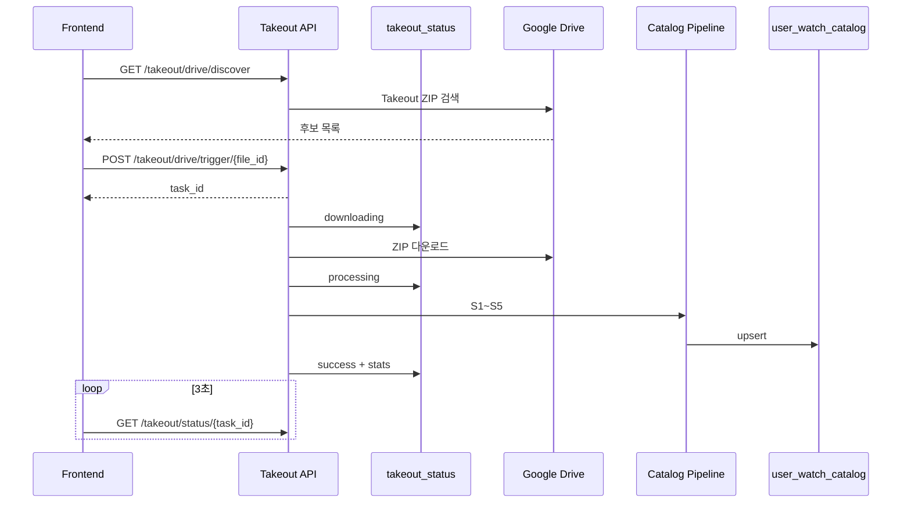

# Indexer — 아키텍처

> **상태:** 2026-06 설계 기준 (구현 진행 중)  
> **DB 상세:** [../erd.md](../erd.md)  
> **역할:** Google Takeout 시청 기록 → `user_watch_catalog` 적재 (인덱서 유일 영속 결과)

---

## 1. 한 줄 정의

**Takeout 파싱 → 광고·노이즈 제거 → 증분 diff → YouTube API 50개 배치 enrich → 임베딩 → catalog upsert (+구독 전체 교체)**

프로파일러(`video_analysis`)·GPT 카테고리 분류·job DB 테이블은 **인덱서 범위 밖**.

구독정보(ZIP의 구독 CSV)는 `user_subscription`에 별도 적재(영상 단위 catalog와 분리). YouTube Music 시청은 `platform=youtube_music`로 라벨.

---

## 2. 레이어 개요

```text
┌─────────────────────────────────────────────────────────────┐
│  frontend/upload-panel.tsx       Drive 탭 · 직접 업로드       │
│       │ discover → 분석 시작 → status 폴링                   │
└─────────────────────────────────────────────────────────────┘
       │
       ▼
┌─────────────────────────────────────────────────────────────┐
│  app/api/v1/takeout.py           Drive ZIP → 백그라운드 job  │
│  app/api/v1/indexer.py           로컬 업로드 · catalog CRUD  │
│       │ takeout_status (메모리 dict) — DB 테이블 없음         │
└─────────────────────────────────────────────────────────────┘
       │
       ▼
┌─────────────────────────────────────────────────────────────┐
│  app/services/takeout_service.py  Drive 검색·다운로드         │
│  app/agents/indexer/nodes/                                          │
│    preprocess · diff · enrich · embed · store · subscriptions      │
└─────────────────────────────────────────────────────────────┘
       │
       ▼
┌─────────────────────────────────────────────────────────────┐
│  app/repositories/indexer_repository.py                       │
│    upsert_catalog_records · delete_user_catalog               │
│    compute_catalog_stats                                      │
└─────────────────────────────────────────────────────────────┘
       │
       ▼
┌─────────────────────────────────────────────────────────────┐
│  app/models/user_watch_catalog.py   인덱서 L0 (유일 DB 결과)   │
└─────────────────────────────────────────────────────────────┘
```

**호출 방향:** `api` → `services` / `agents` → `repositories` → `models`  
에이전트는 FastAPI router를 import하지 않는다.

---

## 3. DB vs 런타임

| 구분 | 저장소 | 내용 |
|------|--------|------|
| **영속 (DB)** | `user_watch_catalog` | 시청 정본 + YouTube API 메타 |
| **휘발 (서버)** | `takeout_status[task_id]` | downloading / processing / success |
| **휘발 (브라우저)** | `localStorage` | `task_id`, 완료 stats 캐시 |

job 진행 상태는 **DB에 저장하지 않음** (`indexer_job` 테이블 없음).

---

## 4. Drive 연동 시퀀스



**UX 원칙**

- 탭 진입 시 **자동 분석 금지** — 「분석 시작」 클릭 후 job 시작
- 페이지 이탈 후 재진입 → `localStorage`의 `task_id`로 폴링 재개

---

## 5. Profiler와의 경계

```text
Indexer                    Profiler
────────                   ────────
user_watch_catalog  ──→    video_analysis (선별 catalog만)
전체 ~수백건               LLM(메타데이터) · embedding
GPT 분류 없음              catalog JOIN으로 description/tags
```

상세: [../erd.md#데이터-흐름](../erd.md)

---

## 6. 코드 위치

| 구분 | 경로 |
|------|------|
| LangGraph | `backend/app/agents/indexer/graph.py` |
| 노드 | `preprocess.py`, `diff.py`, `enrich.py`, `embed.py`, `store.py`, `subscriptions.py` |
| Takeout 파싱·헬퍼 | `backend/app/agents/indexer/utils.py` (ZIP/JSON·광고 필터·플랫폼·구독 CSV·썸네일·숏츠) |
| Repository | `backend/app/repositories/indexer_repository.py` |
| ORM | `backend/app/models/user_watch_catalog.py`, `user_subscription.py` |
| Takeout API | `backend/app/api/v1/takeout.py` |
| Indexer API | `backend/app/api/v1/indexer.py` |
| Drive 서비스 | `backend/app/services/takeout_service.py` |
| 프론트 | `frontend/src/components/upload/upload-panel.tsx` |

---

## 7. 폐기·미사용 (인덱서 경로)

| 항목 | 이유 |
|------|------|
| `user_video_watch` | catalog가 정본 |
| `user_feature_snapshot` | catalog 쿼리로 집계 |
| `indexer_job` 테이블 | 메모리 job으로 충분 (MVP) |
| GPT `classify` | YouTube `categoryId` 사용 |
| `node_sample` / heavy enrich | 프로파일러 선별로 이전 |
