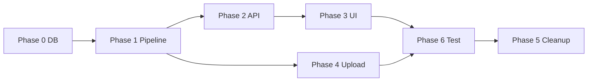

# Indexer — 구현 계획

> **기준:** [ARCHITECTURE.md](./ARCHITECTURE.md), [PIPELINE.md](./PIPELINE.md), [../erd.md](../erd.md)  
> **DB:** ✅ `001_initial_schema` + `user_watch_catalog` + repository

---

## 1. 현재 vs 목표

| 영역 | 현재 | 목표 |
|------|------|------|
| DB | ✅ baseline | 유지 |
| Graph | parse→preprocess→enrich→save | S1~S5 + **dedupe** |
| `tool.py` | 숏츠 60초 + tags | URL `/shorts/` OR **≤180초** |
| 썸네일 | API 우선 | **URL 패턴 우선** |
| Takeout API | `auto` 자동 분석 | discover + **수동 trigger** |
| DriveTab | 탭 진입 auto + 30초 폴링 | 목록 → **분석 시작** |
| 레거시 | classify/sample 노드 잔존 | 인덱ser 경로에서 제거 |

---

## 2. Phase 0 — DB 적용

```powershell
docker compose -f docker-compose.dev.yml down -v
docker compose -f docker-compose.dev.yml up -d db
docker compose -f docker-compose.dev.yml run --rm migrate
```

**완료 기준:** `user_watch_catalog` 테이블 ERD와 일치.

---

## 3. Phase 1 — 코어 파이프라인

### 1-1. `tool.py`

- [ ] `is_shorts(url, duration_sec)` — `constants.SHORTS_MAX_DURATION_SEC`
- [ ] `get_videos_info_batch` — tags 숏츠 제거, thumbnail URL 우선
- [ ] `preprocess` — `platform: "youtube"` 추가

### 1-2. S3 dedupe

- [ ] `dedupe_by_url(items) -> list` — 최신 `watched_at` 1건
- [ ] `node_preprocess` 이후 또는 preprocess 내부 호출

### 1-3. `catalog_pipeline.py` (신규)

```python
async def run_catalog_pipeline(
    file_path: str,
    user_id: UUID,
    *,
    reindex: bool = False,
    on_progress: Callable | None = None,
) -> PipelineResult
```

- [ ] `takeout_service.run_takeout_pipeline` 위임
- [ ] `graph.ainvoke` 동일 로직 공유

### 1-4. State 정리

- [ ] `VideoItem` — `youtube_category_id`, `duration_sec`, `platform`
- [ ] `sampled_data` 등 레거시 필드 제거

**완료 기준:** 로컬 ZIP → catalog N건, 숏츠·categoryId 채워짐.

---

## 4. Phase 2 — Takeout API

- [ ] `GET /takeout/drive/discover`
- [ ] `POST /trigger/{id}?reindex=`
- [ ] `GET /status/{id}` — optional `progress`
- [ ] `POST /drive/auto` deprecate 또는 제거
- [ ] 동일 user 진행 중 job → 409 (선택)

**완료 기준:** Postman trigger → status success → DB 확인.

---

## 5. Phase 3 — DriveTab (프론트)

- [ ] 탭 진입 → discover only
- [ ] Takeout 카드 + 「분석 시작」
- [ ] 폴링 + localStorage `task_id`
- [ ] 「재분석」→ `reindex=true`
- [ ] 제거: auto, 30초 waiting

**완료 기준:** 버튼 누르기 전까지 분석 미실행.

---

## 6. Phase 4 — 업로드 · Indexer API 정합

- [ ] `/indexer/analyze` stats 필드 통일
- [ ] DirectUploadTab / IndexerPage 응답 필드

---

## 7. Phase 5 — 레거시 정리

- [ ] `node_classify`, `node_sample`, `node_heavy_enrich` (graph 미연결 확인 후)
- [ ] `sampling.py` — 미사용 시 제거
- [ ] `graph_extension.py` — 익스텐션 트랙, 별도 유지

---

## 8. Phase 6 — 검증

| 케이스 | 확인 |
|--------|------|
| 광고 Takeout row | S2 제외 |
| `/shorts/` URL | `is_shorts=true` |
| 2분 / 5분 영상 | true / false |
| 동일 URL 2회 | 1행, watched_at 갱신 |
| reindex | catalog 비운 뒤 재적재 |
| 640건 | ~13 API batch 로그 |

---

## 9. MVP 완료 정의

1. Drive Takeout discover → **분석 시작**
2. 백그라운드: 광고 제거 → API 50배치 → **catalog upsert**
3. 숏츠: URL 또는 3분 이하
4. 완료 stats + `GET /indexer/videos`

**범위 밖:** `video_analysis`, embedding, extension graph, `indexer_job` DB.

---

## 10. 의존 관계



---

## 11. 권장 작업 순서

```text
Day 1-2  Phase 1 (tool, dedupe, catalog_pipeline)
Day 3    Phase 2 (takeout API)
Day 4    Phase 3 (DriveTab)
Day 5    Phase 4 + 6
         Phase 5 (여유 시)
```
