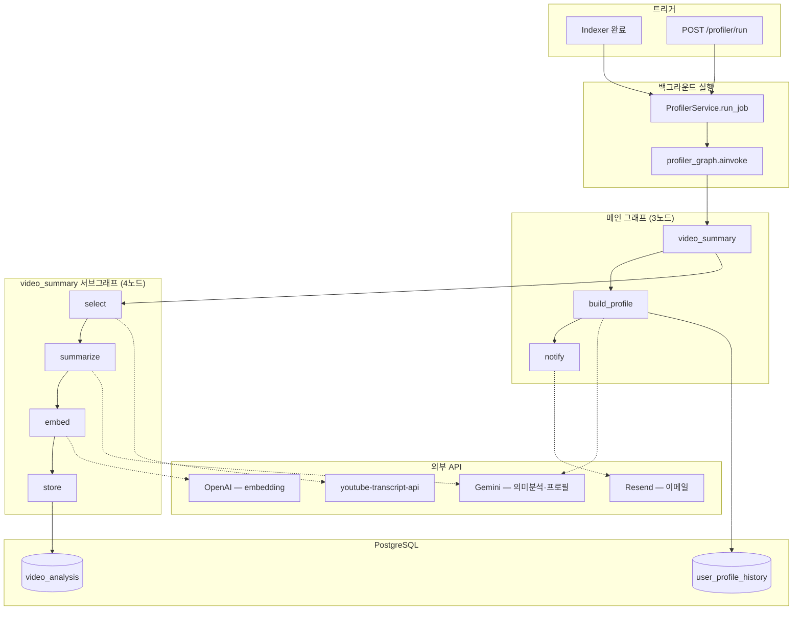
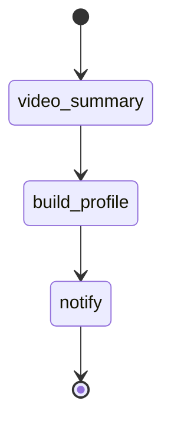
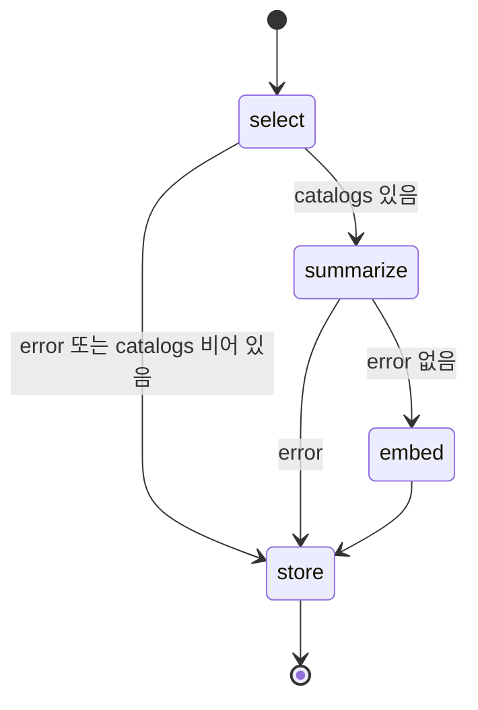
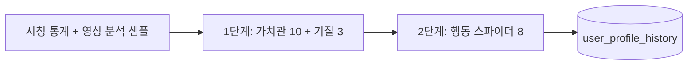
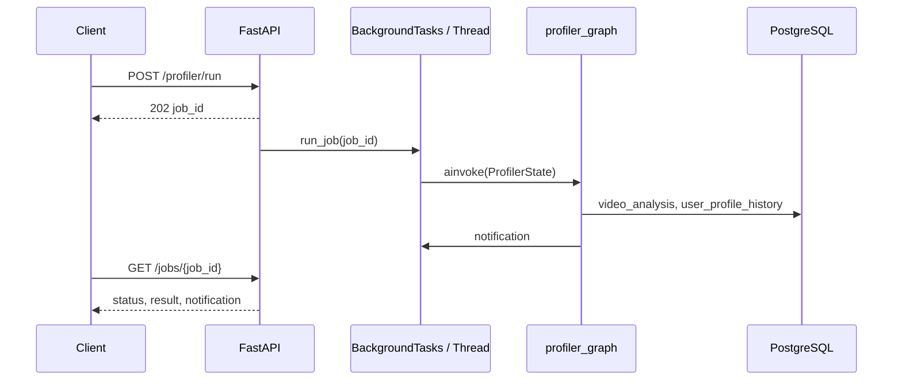

# Profiler — Pipeline

인덱서가 적재한 `user_watch_catalog`를 입력으로, 영상 의미 분석·21축 프로필·이메일 알림까지 이어지는 파이프라인.

ERD: [docs/erd.md](../erd.md)

---

## 1. 전체 흐름

### 트리거

| 경로 | 설명 |
|------|------|
| **인덱서 자동** | `POST /indexer/analyze` 성공 · `saved_count > 0` → `profiler_service.enqueue_for_user(user_id)` |
| **수동** | `POST /profiler/run` (인증 유저, `user.email` 전달) |
| **영상 분석만** | `POST /profiler/video-summary/run` (서브그래프 단독) |

### End-to-end



```text
[시작]
  video_summary   영상 선별 · 자막 · Gemini 분석 · 임베딩 · video_analysis 저장
  build_profile   catalog 통계 + 분석 샘플 → 21축 점수(2단계) + 해석 → user_profile_history
  notify          완료 이메일 (notify_email 있을 때)
```

---

## 2. 메인 그래프

**파일:** `backend/app/agents/profiler/graph.py`



| 노드 | 파일 | 역할 |
|------|------|------|
| `video_summary` | `nodes/video_summary.py` | 서브그래프 `run_video_summary()` 호출 |
| `build_profile` | `nodes/build_profile.py` | 21축 점수·해석 산출 후 DB 스냅샷 저장 |
| `notify` | `nodes/notify.py` | Resend 이메일 + `NotificationPayload` |

**상태:** `agents/profiler/state/profiler.py` (`ProfilerState`)

---

## 3. video_summary 서브그래프

**파일:** `backend/app/agents/profiler/sub_agent/video_summary/graph.py`



| 노드 | 파일 | 역할 |
|------|------|------|
| `select` | `nodes/select.py` | 분석 대상 catalog 선별 + YouTube 자막 fetch |
| `summarize` | `nodes/summarize.py` | Gemini structured output — 브리프·톤·의도·가치 |
| `embed` | `nodes/embed.py` | `embedding_text` → OpenAI `text-embedding-3-small` |
| `store` | `nodes/store.py` | `profiler_repository.upsert_video_analysis` |

### 3.1 select — 영상 선별

| `analysis_limit` | 동작 |
|------------------|------|
| **있음** (API `limit` 쿼리) | 미분석 catalog N건 (`fetch_unanalyzed_catalog`) |
| **없음** (메인 프로파일러) | 전체 catalog에서 대표 샘플 (`select_analysis_sample`) |

샘플링 규칙 (`services/profiler/sampling.py`):

- 롱폼 / 숏폼 각 **상위 채널 5개**당 대표 1편
- 카테고리별 **상위 채널 5개**당 대표 1편 (중복 제거)

선별 후 영상 URL마다 자막을 fetch (동시 4건). 결과는 `CatalogInput` 리스트로 `catalogs` state에 적재.

### 3.2 summarize — 의미 분석

- **모델:** Gemini (`invoke_gemini_structured`)
- **스키마:** `schemas/profiler/video.py` → `VideoSemanticAnalysis`
- **프롬프트:** `sub_agent/video_summary/prompt.py`

| 필드 | 설명 |
|------|------|
| `summary_kr` | 프로파일링용 시맨틱 브리프 (3~5문장: 주제·동기·소비방식·톤 맥락·가치) |
| `tones` | 톤 라벨 ×3 |
| `intents` | 의도 라벨 ×3 |
| `value_signals` | 가치 신호 라벨 ×3 |

동시 처리 8건. 1건 실패는 스킵, 배치는 계속.

### 3.3 embed · store

- `embedding_text` = summary + 톤 + 의도 + 가치 (문자열 조합)
- 임베딩: `agents/shared/embedding.py` (`embed_texts`, 1536차원)
- `video_analysis`에 catalog 1:1 upsert (`catalog_id` UK)

---

## 4. build_profile — 21축 프로필

**파일:** `nodes/build_profile.py` · **프롬프트:** `agents/profiler/prompt.py`

### 입력

1. `user_watch_catalog` 전체 → `catalog_stats` (카테고리 비율, 숏폼/롱폼 비율 등)
2. `video_analysis` 샘플 (요약·톤·의도·가치 신호)

### 점수 산출 (2단계 LLM)



| 단계 | 축 | 개수 |
|------|-----|------|
| 1 | Schwartz 가치관 | 10 |
| 1 | TCI 기질 | 3 |
| 2 | 행동 스파이더 | 8 |

- LLM 실패 시 단계별 **rule fallback** (`rule_based_values_temperament` → `rule_based_behavior_spider`)
- 해석(`ProfileInsightOutput`): LLM 또는 템플릿 → `summary_text`, `persona_label`, `dominant_traits` 등
- `insert_profile_snapshot` → `user_profile_history` (commit은 노드에서 수행)

---

## 5. notify

- 수신: `ProfilerState.notify_email`
- `POST /profiler/run` → `user.email` 설정됨
- 인덱서 자동 큐잉 → 현재 `enqueue_for_user(user_id)`만 호출 (**이메일 미전달 시 스킵**)
- `RESEND_API_KEY` 없으면 발송 skipped

---

## 6. 비동기·Job 실행



| 구간 | 방식 |
|------|------|
| HTTP 응답 | 즉시 `202` + `job_id` |
| `POST /profiler/run` | FastAPI `BackgroundTasks` |
| 인덱서 → 프로파일러 | `threading.Thread` (daemon) |
| 그래프 | `async` `ainvoke` (노드 대부분 async) |
| Job 상태 | 인메모리 `ProfilerService._jobs` (재시작 시 소실) |

---

## 7. DB · Repository

| 테이블 | 쓰기 노드 | 읽기 |
|--------|-----------|------|
| `user_watch_catalog` | Indexer | `profiler_repository.fetch_catalog_rows` 등 |
| `video_analysis` | `store` | `build_profile`, `fetch_unanalyzed_catalog` |
| `user_profile_history` | `build_profile` | `GET /profiler/me/profile`, job result |

**Repository:** `backend/app/repositories/profiler_repository.py`  
**트랜잭션:** 레포는 flush/execute, `commit`은 노드·API에서 수행.

---

## 8. HTTP API

| Method | Path | 설명 |
|--------|------|------|
| `POST` | `/api/v1/profiler/run` | 메인 파이프라인 job 시작 |
| `GET` | `/api/v1/profiler/jobs/{job_id}` | job 상태·프로필 결과·알림 |
| `GET` | `/api/v1/profiler/me/profile` | 최신 `user_profile_history` |
| `GET` | `/api/v1/profiler/profile/{user_id}` | 동일 (user_id 지정) |
| `POST` | `/api/v1/profiler/video-summary/run` | 서브그래프만 (`limit` optional) |
| `GET` | `/api/v1/profiler/video-summary/{task_id}` | 영상 분석 단독 task 상태 |

**응답 스키마:** `schemas/profiler/api.py` — `DbProfileResponse` (`snapshot_id`, `scores` 21키, 해석 필드)

---

## 9. 디렉터리 맵

```text
backend/app/
  agents/profiler/
    graph.py                 # 메인 그래프
    prompt.py                # build_profile LLM 프롬프트
    nodes/
      video_summary.py       # 서브그래프 진입
      build_profile.py
      notify.py
    sub_agent/video_summary/
      graph.py
      prompt.py              # 영상 의미분석 프롬프트
      nodes/ select, summarize, embed, store
      tool.py                # 자막 fetch 등
    state/profiler.py
  agents/shared/
    embedding.py             # OpenAI embed_texts (인덱서·프로파일러 공용)
  services/profiler/
    service.py               # Job 큐
    sampling.py              # 영상 선별
  repositories/
    profiler_repository.py
  api/v1/profiler.py
  schemas/profiler/
```

---

## 10. 알려진 제약

- Job·video-summary task 상태는 **프로세스 메모리** (다중 워커/재시작 시 유실)
- 인덱서 자동 실행 시 **이메일 미전달** → notify 스킵 가능
- Navigator FE는 구 mock API·Layer B 스펙 일부 미정리 (프로파일러 백엔드와 별도)
