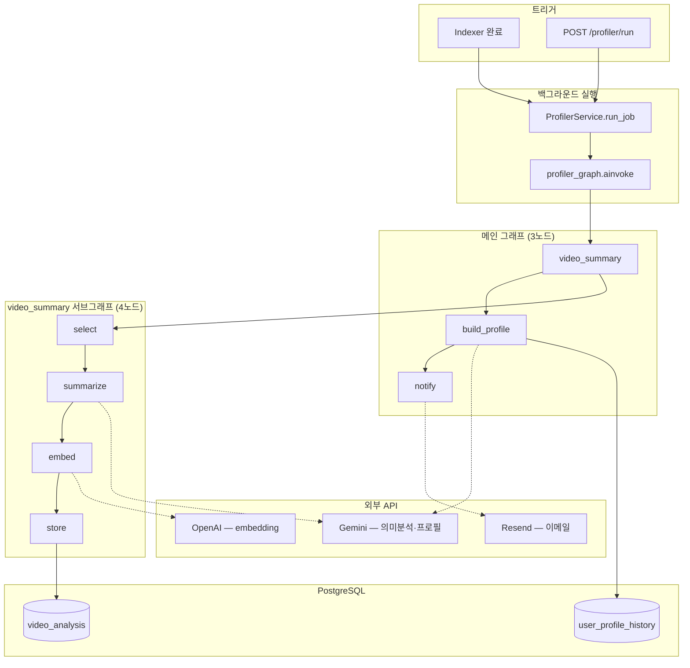
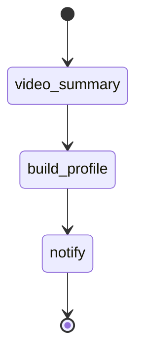
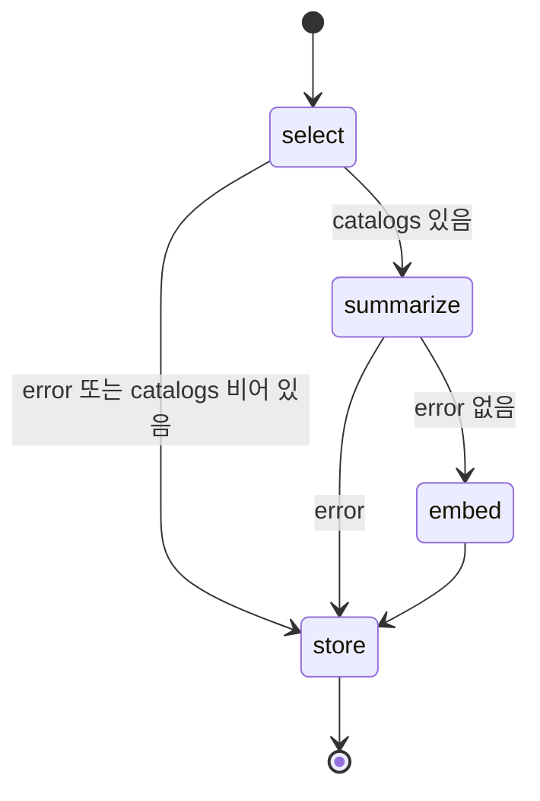
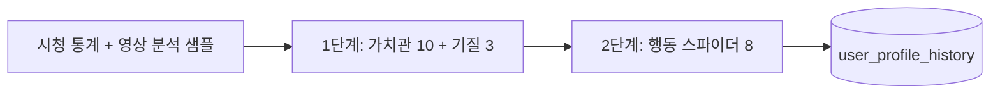
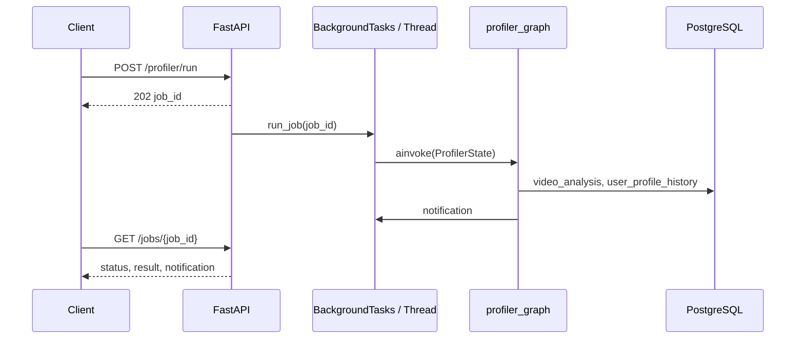

# Profiler — Pipeline

인덱서가 적재한 `user_watch_catalog`를 입력으로, 영상 의미 분석·21축 프로필·이메일 알림까지 이어지는 파이프라인.

ERD: [docs/erd.md](../erd.md)

---

## 1. 전체 흐름

### 트리거

| 경로 | 설명 |
|------|------|
| **인덱서 자동(배치)** | "분석 시작" 클릭 = 한 배치(`batch_id`). 업로드가 다 끝나면 프론트가 `POST /indexer/batch/{id}/seal`("다 보냄")을 보내고, 배치의 모든 소스 인덱싱이 끝나면 `enqueue_for_user(analysis_source_ids, batch_id)`로 **그 배치 영상만** 1회 분석 |
| **수동** | `POST /profiler/run` — `batch_id` 없음 → **통합본**(창고 전체 최근 2달) |
| **영상 분석만** | `POST /profiler/video-summary/run` (서브그래프 단독) |

> **배치 스코프**: `batch_id` 없이 온 소스(Drive 자동·구경로)는 서버가 단일 배치를 자동 생성·자동 seal한다. seal이 안 오면 `reconcile_stuck_batches`(자동-seal 안전망, WARNING 로그)가 마감한다. 트리거는 `analysis_batch.status`를 `sealed→profiling`으로 **원자 전환**한 호출만 발사(중복 방지). 킬스위치 `PROFILER_BATCH_SCOPE_ENABLED=false`면 통합본으로 산출.

### End-to-end



```text
[시작]
  video_summary   영상 선별 · Gemini 분석(메타데이터) · 임베딩 · video_analysis 저장
  build_profile   catalog 통계 + 분석 샘플 → 21축 점수(2단계) + 해석 → user_profile_history
  notify          완료 이메일 (notify_email 있을 때)
```

---

## 2. 메인 그래프

**파일:** `backend/app/agents/profiler/graph.py`



| 노드 | 파일 | 역할 |
|------|------|------|
| `video_summary` | `nodes/video_summary.py` | 서브그래프 `run_video_summary()` 호출 |
| `build_profile` | `nodes/build_profile.py` | 21축 점수·해석 산출 후 DB 스냅샷 저장 |
| `notify` | `nodes/notify.py` | Resend 이메일 + `NotificationPayload` |

**상태:** `agents/profiler/state/profiler.py` (`ProfilerState`)

---

## 3. video_summary 서브그래프

**파일:** `backend/app/agents/profiler/sub_agent/video_summary/graph.py`



| 노드 | 파일 | 역할 |
|------|------|------|
| `select` | `nodes/select.py` | 분석 대상 catalog 선별 (메타데이터만, 자막 미수집) |
| `summarize` | `nodes/summarize.py` | Gemini structured output — 브리프·톤·의도·가치 |
| `embed` | `nodes/embed.py` | `embedding_text` → OpenAI `text-embedding-3-small` |
| `store` | `nodes/store.py` | `profiler_repository.upsert_video_analysis` |

### 3.1 select — 영상 선별

| `analysis_limit` | 동작 |
|------------------|------|
| **있음** (API `limit` 쿼리) | 미분석 catalog N건 (`fetch_unanalyzed_catalog`) |
| **없음** (메인 프로파일러) | 전체 catalog에서 대표 샘플 (`select_analysis_sample`) |

샘플링 규칙 (`services/profiler/sampling.py`):

- 롱폼 / 숏폼 각 **상위 채널 5개**당 대표 1편
- 카테고리별 **상위 채널 5개**당 대표 1편 (중복 제거)

선별 결과를 `CatalogInput` 리스트로 `catalogs` state에 적재한다. (자막은 youtube-transcript-api IP 차단으로 수집률 0%라 제거함 — 008. 제목·설명·태그·카테고리 메타데이터만으로 분석)

### 3.2 summarize — 의미 분석

- **모델:** Gemini (`invoke_gemini_structured`)
- **스키마:** `schemas/profiler/llm/video.py` → `VideoSemanticAnalysis`
- **프롬프트:** `sub_agent/video_summary/prompts.py`

| 필드 | 설명 |
|------|------|
| `summary_kr` | 프로파일링용 시맨틱 브리프 (3~5문장: 주제·동기·소비방식·톤 맥락·가치) |
| `tones` | 톤 라벨 ×3 |
| `intents` | 의도 라벨 ×3 |
| `value_signals` | 가치 신호 라벨 ×3 |

동시 처리 8건. 1건 실패는 스킵, 배치는 계속.

### 3.3 embed · store

- `embedding_text` = summary + 톤 + 의도 + 가치 (문자열 조합)
- 임베딩: `agents/shared/embedding.py` (`embed_texts`, 1536차원)
- `video_analysis`에 catalog 1:1 upsert (`catalog_id` UK)

---

## 4. build_profile — 21축 프로필

**파일:** `nodes/build_profile.py` · **프롬프트:** `agents/profiler/prompts.py` · **의미라벨 매핑:** `agents/profiler/semantics.py`

### 입력

1. catalog → `catalog_stats` (카테고리 비율, 숏폼/롱폼 비율 등)
   - **배치 분석**: `fetch_catalog_rows_by_sources` — 그 배치 소스들 소속 영상(조인 `analysis_source_catalog`)의 **합집합을 최근 2달로 재컷**(앵커=배치 집합 내 max watched_at). 겹치는 영상도 무손실 포함.
   - **통합본**: `fetch_recent_catalog_rows` — 창고 전체 최근 2달.
2. `video_analysis` 샘플 (요약·톤·의도·가치 신호) — 배치 분석 시 그 catalog 행들 것만

### 점수 산출 (2단계 LLM)



| 단계 | 축 | 개수 |
|------|-----|------|
| 1 | Schwartz 가치관 | 10 |
| 1 | TCI 기질 | 3 |
| 2 | 행동 스파이더 | 8 |

- LLM 실패 시 단계별 **rule fallback** (`rule_based_values_temperament` → `rule_based_behavior_spider`)
- 해석(`ProfileInsightOutput`): LLM 또는 템플릿 → `summary_text`, `persona_label`, `dominant_traits` 등
- `insert_profile_snapshot` → `user_profile_history` (commit은 노드에서 수행)

---

## 5. notify

- 수신: `ProfilerState.notify_email`
- `POST /profiler/run` → `user.email` 설정됨
- 인덱서/Drive 자동 큐잉도 `enqueue_for_user(user_id, user.email)`로 **이메일 전달함** (takeout·indexer 라우터 모두)
- `RESEND_API_KEY` 없으면 발송 skipped

> 자동 트리거(`enqueue_for_user`)는 `loop.create_task`로 실행하되 **`ProfilerService._bg_tasks` set에 강한 참조를 보관**하므로 GC 수거로 인한 메일 누락은 방지된다(과거 이슈, 해결됨). 수동 `POST /run`은 `BackgroundTasks` 사용.
> 유저가 보는 **진행 상태(분류중/분석중)는 DB 기반**(`user_analysis_source.status`+`stage`)이라 재시작에도 유지된다. 인메모리로 남는 건 `GET /profiler/jobs/{job_id}` 폴링용 캐시(`_jobs`)뿐이며, 그 산출물(프로필·running 상태)은 이미 DB에 있다.

---

## 5b. compare 서브에이전트 (스냅샷 비교)

메인 그래프와 별개로, **두 `user_profile_history` 스냅샷을 비교**하는 서브에이전트 (`sub_agent/compare/`). API `GET /me/analyses/compare?from=&to=`에서 파사드(`ProfilerAgent.compare`)를 통해 호출.

```text
load(두 스냅샷) → diff(축별 결정적 변화) → summarize(LLM 변화 서술) → END
```

- `diff`는 규칙 기반(결정적), `summarize`만 LLM 내러티브.
- 결과: 축별 gap + 변화 요약 → `AnalysisCompareResponse`.

---

## 6. 비동기·Job 실행



| 구간 | 방식 |
|------|------|
| HTTP 응답 | 즉시 `202` + `job_id` |
| `POST /profiler/run` | FastAPI `BackgroundTasks` |
| 인덱서 → 프로파일러 | `threading.Thread` (daemon) |
| 그래프 | `async` `ainvoke` (노드 대부분 async) |
| Job 상태 | 인메모리 `ProfilerService._jobs` (재시작 시 소실) |

---

## 7. DB · Repository

| 테이블 | 쓰기 노드 | 읽기 |
|--------|-----------|------|
| `user_watch_catalog` | Indexer | `profiler_repository.fetch_catalog_rows` 등 |
| `video_analysis` | `store` | `build_profile`, `fetch_unanalyzed_catalog` |
| `user_profile_history` | `build_profile` | `GET /profiler/me/profile`, job result |

**Repository:** `backend/app/repositories/profiler_repository.py`  
**트랜잭션:** 레포는 flush/execute, `commit`은 노드·API에서 수행.

---

## 8. HTTP API

| Method | Path | 설명 |
|--------|------|------|
| `POST` | `/api/v1/profiler/run` | 메인 파이프라인 job 시작 |
| `GET` | `/api/v1/profiler/jobs/{job_id}` | job 상태·프로필 결과·알림 |
| `GET` | `/api/v1/profiler/me/profile` | 최신 `user_profile_history` |
| `GET` | `/api/v1/profiler/me/analyses` | 분석 목록 (완료 스냅샷 + 진행 중 job) |
| `GET` | `/api/v1/profiler/me/analyses/compare?from=&to=` | 두 스냅샷 비교 (compare 서브에이전트) |
| `GET` | `/api/v1/profiler/me/analyses/{snapshot_id}` | 스냅샷 단건 |
| `GET` | `/api/v1/profiler/profile/{user_id}` | 최신 (user_id 지정) |
| `POST` | `/api/v1/profiler/video-summary/run` | 서브그래프만 (`limit` optional) |
| `GET` | `/api/v1/profiler/video-summary/{task_id}` | 영상 분석 단독 task 상태 |

**응답 스키마:** `schemas/profiler/api.py` — `DbProfileResponse` (`snapshot_id`, `scores` 21키, 해석 필드)

---

## 9. 디렉터리 맵

```text
backend/app/
  agents/profiler/
    facade.py                # ProfilerAgent 파사드 (run_profile·compare·summarize_videos)
    graph.py                 # 메인 그래프 (video_summary→build_profile→notify)
    prompts.py               # build_profile 2단계 LLM 프롬프트
    semantics.py             # 의미라벨(tone/intent/value) → 13축 근거 매핑
    scores.py(서비스)·axis_labels.py·habit_metrics.py
    nodes/
      video_summary.py       # 서브그래프 진입
      build_profile.py       # 21축 채점 (2단계 LLM + rule 블렌드 + calibration)
      notify.py
    sub_agent/video_summary/
      graph.py
      prompts.py             # 영상 의미분석 프롬프트 (메타데이터 기반)
      nodes/ select, summarize, embed, store
    sub_agent/compare/        # 두 스냅샷 비교 (load→diff→summarize)
      graph.py · nodes/ · prompts.py · state.py · utils.py
    state/profiler.py
  agents/shared/
    embedding.py             # OpenAI embed_texts (인덱서·프로파일러 공용)
    analysis_window.py       # WATCH_CATALOG_WINDOW_DAYS (인덱서·프로파일러 공유)
  services/profiler/
    service.py               # Job 오케스트레이션 (인메모리)
    sampling.py              # 영상 선별
    scores.py                # history_scores_dict 등
  repositories/
    profiler_repository.py
  api/v1/profiler.py
  schemas/profiler/          # http/ , llm/ , job.py
```

---

## 10. 알려진 제약

- **진행 상태·결과는 DB 영속**: running/completed/failed·`stage`는 `user_analysis_source`, 프로필은 `user_profile_history`. 분석 목록(`list_analyses_async`)은 DB만 읽어 재시작에 안전.
- 인메모리로 남는 것은 `GET /profiler/jobs/{job_id}` 폴링용 `_jobs` 캐시·video-summary task 상태뿐(재시작 시 그 단건 폴링만 `not_found`). 자동 트리거 태스크는 `_bg_tasks` 강한참조로 GC 유실 방지됨.
- **크래시로 중단된 소스는 고아화**: 실행 중 프로세스가 죽으면 `user_analysis_source`가 `running`/`stage`인 채 남아 화면에 "분류/분석 중"이 계속 표시됨(재개·타임아웃·reconcile 없음).
- Resend rate limit 시 메일 발송 실패해도 예외 없이 `sent=False` (조용히 스킵)
