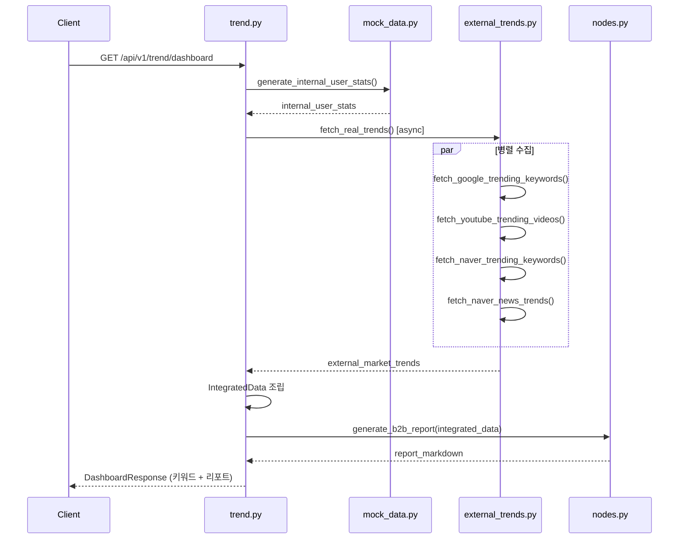

# 트렌드 분석 — 외부 실시간 데이터 연동 개발 문서

> **작성일:** 2026-06-09  
> **브랜치:** `feature/aggregator`  
> **스키마 버전:** `0.2.0`  
> **대상 독자:** 프로젝트에 처음 합류하는 개발자, 기획·QA, 운영 담당자

---

## 1. 이 문서가 설명하는 것

이 문서는 **Synapse Platform** 백엔드의 **트렌드 분석(Aggregator)** 기능이 어떻게 동작하는지, 그리고 2026-06-09 기준으로 수행된 **아키텍처 리팩토링 및 외부 데이터 연동** 내용을 정리합니다.

읽는 사람이 사전 지식 없이도 아래를 이해할 수 있도록 작성했습니다.

- 이 기능이 **왜** 필요한지
- 요청이 들어오면 **어떤 순서**로 처리되는지
- **어떤 파일**이 어떤 역할을 하는지
- **어떤 외부 API/RSS**에서 데이터를 가져오는지
- API를 **어떻게 호출하고 테스트**하는지
- **환경 변수**와 **Fallback(백업) 전략**은 무엇인지

---

## 2. 프로젝트 맥락 — Synapse Platform이란?

Synapse Platform은 콘텐츠·미디어 소비 행동을 분석하는 플랫폼입니다. 여러 AI 에이전트가 협력하며, 그중 **Aggregator 에이전트**가 **트렌드 분석**을 담당합니다.

Aggregator의 핵심 임무는 다음과 같습니다.

1. **플랫폼 내부** 사용자들의 비식별 통계(키워드 빈도, 8각 인지 성향)를 확보한다.
2. **외부 시장**의 실시간 트렌드(Google, YouTube, Naver 등)를 수집한다.
3. 두 데이터를 합쳐 **Gemini LLM**에게 넘기고, B2B 의사결정자용 **마크다운 리포트**를 생성한다.

광고주, 미디어 기획사, 콘텐츠 플랫폼 운영자가 "우리 유저는 무엇에 관심 있는가?"와 "지금 시장은 무엇이 뜨는가?"의 **격차(Gap)** 를 한눈에 파악할 수 있게 하는 것이 목표입니다.

---

## 3. 개발 배경 — 무엇이 문제였나?

### 3.1 기존 구조 (리팩토링 전)

초기 MVP에서는 `mock_data.py` 한 파일에 아래가 **모두 하드코딩**되어 있었습니다.

| 데이터 종류 | 설명 | 문제점 |
|------------|------|--------|
| `internal_user_stats` | 플랫폼 내부 유저 키워드·8각 성향 Mock | Mock이므로 유지 필요 (당분간) |
| `external_market_trends` | Google/YouTube 트렌드 **가짜 데이터** | 실시간성 없음, 역할 혼재 |

즉, **"가짜 내부 통계"** 와 **"가짜 외부 트렌드"** 가 한 모듈에 섞여 있어 다음 문제가 있었습니다.

- 외부 데이터를 실제 API로 바꿀 때 `mock_data.py` 전체를 건드려야 함
- Mock 레이어와 실시간 수집 레이어의 **책임 경계**가 불명확
- 테스트·운영 시 "어디가 진짜 데이터인지" 구분이 어려움

### 3.2 목표 구조 (리팩토링 후)

```
┌─────────────────────┐     ┌──────────────────────────┐
│  mock_data.py       │     │  external_trends.py      │
│  (내부 Mock 전용)    │     │  (외부 실시간 수집 전용)  │
└─────────┬───────────┘     └────────────┬─────────────┘
          │                              │
          └──────────┬───────────────────┘
                     ▼
          ┌─────────────────────┐
          │  trend.py (라우터)   │  ← 두 레이어 데이터를 조립
          └─────────┬───────────┘
                    ▼
          ┌─────────────────────┐
          │  nodes.py (Gemini)   │  ← 통합 JSON → B2B 리포트
          └─────────────────────┘
```

**원칙:** Mock은 Mock끼리, 실시간은 실시간끼리 모으고, **조립은 API 라우터**에서만 수행한다.

---

## 4. 전체 요청 처리 흐름

사용자(또는 프론트엔드)가 `GET /api/v1/trend/dashboard`를 호출하면 아래 순서로 처리됩니다.



### 4.1 엔드포인트 목록

| 메서드 | 경로 | 설명 | Gemini 호출 |
|--------|------|------|-------------|
| `GET` | `/api/v1/trend/dashboard` | 내부 상위 키워드 + B2B 마크다운 리포트 | **예** |
| `GET` | `/api/v1/trend/graph` | 8각 인지 성향 차트용 코호트 데이터 | 아니오 |

> Swagger UI: 서버 실행 후 `http://127.0.0.1:8000/docs` 에서 확인 가능

---

## 5. 파일별 상세 설명

### 5.1 `backend/app/agents/aggregator/mock_data.py`

**역할:** 플랫폼 **내부** 비식별 사용자 통계 Mock 생성 (외부 트렌드 없음)

**제공 함수:**

```python
generate_internal_user_stats(*, seed: int | None = None) -> InternalUserStats
```

**반환 구조:**

```json
{
  "top_keywords": [
    {"keyword": "AI 에이전트", "frequency": 12500, "trend_delta_pct": 12.3}
  ],
  "cognitive_bias_map": {
    "axes": [
      {"key": "intellectual_curiosity", "label": "지적 호기심", "avg_score": 52.1}
    ],
    "cohort_size": 18500,
    "measurement_period": "2026-06-01 ~ 2026-06-09"
  }
}
```

**8각 인지 성향 축 (프로파일러 에이전트와 공유 스키마):**

| Key | UI 라벨 |
|-----|---------|
| `intellectual_curiosity` | 지적 호기심 |
| `self_improvement` | 자기계발 |
| `social_awareness` | 사회·시선 |
| `depth_immersion` | 깊이·몰입 |
| `practical_orientation` | 실용 지향 |
| `emotional_comfort` | 정서·위로 |
| `creative_expression` | 창의·표현 |
| `entertainment_release` | 오락·해방 |

> **향후 계획:** 실제 Profiler 에이전트·DB 연동 시 이 Mock 함수를 실데이터 조회로 교체 예정

---

### 5.2 `backend/app/services/external_trends.py`

**역할:** **외부** 실시간 트렌드 수집 전담 비즈니스 로직 (순수 서비스 레이어)

**의존성:** `httpx` (비동기 HTTP), `feedparser` (RSS/XML 파싱)

#### 수집 함수 4종

| 함수 | 데이터 소스 | 수집 방식 |
|------|------------|-----------|
| `fetch_google_trending_keywords()` | Google Trends KR RSS | RSS 파싱 |
| `fetch_youtube_trending_videos()` | YouTube Data API v3 | REST API |
| `fetch_naver_trending_keywords()` | Signal.bz API (네이버 실검 대체) | REST API |
| `fetch_naver_news_trends()` | 네이버 뉴스 RSS → 연합뉴스 RSS Fallback | RSS 파싱 |

#### 통합 함수

```python
async def fetch_real_trends() -> ExternalMarketTrends
```

4개 소스를 `asyncio.gather`로 **병렬** 호출한 뒤 하나의 딕셔너리로 반환합니다.

---

### 5.3 `backend/app/agents/aggregator/types.py`

**역할:** 라우터·에이전트가 공유하는 **통합 데이터 타입** 정의

```python
INTEGRATED_SCHEMA_VERSION = "0.2.0"

class IntegratedData(TypedDict):
    schema_version: str
    generated_at: str
    internal_user_stats: InternalUserStats      # mock_data
    external_market_trends: ExternalMarketTrends  # external_trends
```

---

### 5.4 `backend/app/api/v1/trend.py`

**역할:** FastAPI **라우터** — 유일한 **데이터 조립 지점**

```python
async def get_integrated_data() -> IntegratedData:
    user_mock = generate_internal_user_stats()
    external_real = await external_trends.fetch_real_trends()
    return {
        "schema_version": INTEGRATED_SCHEMA_VERSION,
        "generated_at": datetime.now(tz=UTC).isoformat(),
        "internal_user_stats": user_mock,
        "external_market_trends": external_real,
    }
```

- 모든 엔드포인트가 `async`로 전환됨
- FastAPI `Depends`로 요청당 `get_integrated_data()` 결과가 캐시되어 `/dashboard` 내 중복 호출 방지

---

### 5.5 `backend/app/agents/aggregator/nodes.py`

**역할:** Gemini LLM 호출 및 B2B 마크다운 리포트 생성

**주요 변경:**

- `generate_b2b_report()` → **async** 함수 (`llm.ainvoke` 사용)
- 입력 타입: `MockIntegratedData` → `IntegratedData`
- 통합 데이터 없이 호출 시 `ValueError` (라우터에서 조립된 데이터 필수)

**모델 설정:**

| 항목 | 기본값 |
|------|--------|
| Primary 모델 | `gemini-2.5-flash` |
| Fallback 모델 | `gemini-1.5-flash` |
| API 키 환경 변수 | `GOOGLE_API_KEY` 또는 `GEMINI_API_KEY` |

---

### 5.6 `backend/app/agents/aggregator/prompts.py`

**역할:** Gemini 시스템·유저 프롬프트 정의

**주요 보강 (네이버 연동 후):**

- `naver_search`, `naver_news` 데이터 존재를 명시
- **Google/YouTube(가벼운 미디어 소비)** vs **네이버 뉴스(사회적 의제)** 간 대중 여론 **이중 구조** 비교 지침
- 8각 성향 분포와 외부 트렌드의 **다각도 미디어 중립성 평가** 유도

리포트는 고정 Markdown 템플릿을 따릅니다.

1. `# 요약`
2. `## 매크로 트렌드 TOP 5`
3. `## 미디어 중립성 및 성향 분포 평가`

---

## 6. 데이터 스키마 상세

### 6.1 통합 데이터 (`IntegratedData`) 전체 예시

```json
{
  "schema_version": "0.2.0",
  "generated_at": "2026-06-09T12:00:00+00:00",
  "internal_user_stats": {
    "top_keywords": [ "..." ],
    "cognitive_bias_map": { "..." }
  },
  "external_market_trends": {
    "google_trends": [ "..." ],
    "youtube_trending": [ "..." ],
    "naver_search": [ "..." ],
    "naver_news": [ "..." ],
    "data_collected_at": "2026-06-09T12:00:01+00:00"
  }
}
```

### 6.2 `external_market_trends` 필드별 스키마

#### `google_trends[]`

| 필드 | 타입 | 설명 |
|------|------|------|
| `keyword` | string | 급상승 검색어 |
| `rank` | int | 순위 (1부터) |
| `interest_index` | int | RSS `approx_traffic` 파싱값 (예: 2000) |
| `wow_change_pct` | float | 전주 대비 (RSS 미제공 시 `0.0`) |

**소스 URL:** `https://trends.google.com/trending/rss?geo=KR`

#### `youtube_trending[]`

| 필드 | 타입 | 설명 |
|------|------|------|
| `keyword` | string | 동영상 제목 |
| `rank` | int | 순위 |
| `category` | string | 카테고리 (한글 매핑) |
| `estimated_views` | int | 조회수 |

**소스:** YouTube Data API `videos.list(chart=mostPopular, regionCode=KR)`

#### `naver_search[]`

| 필드 | 타입 | 설명 |
|------|------|------|
| `keyword` | string | 실시간 검색어 |
| `rank` | int | 순위 |
| `search_volume_hint` | int | 검색량 힌트 (API `count` 필드) |
| `state` | string | 상태 코드 (`s`: 급상승, `-`: 유지 등) |

**소스 우선순위:**

1. `https://api.signal.bz/news/realtime` (시그널 — 네이버 실검 대체 서비스)
2. `https://api.isignal.co/news/realtime` (대안)
3. 내장 Fallback 키워드 8건

> 네이버는 2020년 이후 공식 실시간 검색어를 제공하지 않습니다. 시그널(Signal.bz)이 사실상의 대체 수단으로 널리 사용됩니다.

#### `naver_news[]`

| 필드 | 타입 | 설명 |
|------|------|------|
| `headline` | string | 뉴스 헤드라인 |
| `rank` | int | 순위 (최신순 정렬 후 부여) |
| `press` | string | 언론사명 |
| `section` | string | 섹션 (정치/경제/사회/IT/과학) |
| `published_at` | string | 발행 시각 (ISO 8601) |
| `link` | string | 기사 URL |

**소스 우선순위:**

1. 네이버 뉴스 섹션 RSS (정치·경제·사회·IT/과학)
2. **Fallback:** 연합뉴스 섹션 RSS (네이버 RSS 2022년 3월 서비스 중단)
3. **선택:** 네이버 검색 Open API (`NAVER_CLIENT_ID` / `NAVER_CLIENT_SECRET` 설정 시)
4. 내장 Fallback 헤드라인 6건

---

## 7. Fallback(백업) 전략 — 왜 필요한가?

외부 API는 언제든 실패할 수 있습니다.

- API 키 미설정
- Rate limit / 403 / 404
- 네트워크 타임아웃 (15초)
- 서비스 구조 변경

모든 수집 함수는 **실패해도 빈 응답을 내지 않고** 현실적인 더미 데이터를 반환합니다. 파이프라인 전체가 중단되지 않도록 설계했습니다.

| 소스 | Fallback 조건 | Fallback 내용 |
|------|--------------|---------------|
| YouTube | API 키 없음 또는 HTTP 오류 | 국내 트렌드형 더미 8건 |
| Naver 검색 | 모든 API 엔드포인트 실패 | 더미 키워드 8건 |
| Naver 뉴스 | RSS·Open API 모두 실패 | 더미 헤드라인 6건 |
| Google | (현재) 예외 전파 | Google RSS는 안정적이라 별도 Fallback 없음 |

---

## 8. 환경 변수

`backend/.env` 파일에 설정합니다.

| 변수명 | 필수 여부 | 용도 |
|--------|----------|------|
| `GOOGLE_API_KEY` 또는 `GEMINI_API_KEY` | **dashboard 필수** | Gemini B2B 리포트 생성 |
| `YOUTUBE_API_KEY` | 선택 | YouTube 실시간 급상승 (없으면 Fallback) |
| `NAVER_CLIENT_ID` | 선택 | 네이버 뉴스 검색 API 보조 수집 |
| `NAVER_CLIENT_SECRET` | 선택 | 네이버 뉴스 검색 API 보조 수집 |
| `GEMINI_MODEL` | 선택 | 모델 오버라이드 (기본: `gemini-2.5-flash`) |

**예시 `.env`:**

```env
GOOGLE_API_KEY=your_gemini_api_key
YOUTUBE_API_KEY=your_youtube_data_api_key
NAVER_CLIENT_ID=your_naver_client_id
NAVER_CLIENT_SECRET=your_naver_client_secret
```

> ⚠️ `.env` 파일은 Git에 커밋하지 마세요. API 키가 노출되면 즉시 폐기·재발급하세요.

---

## 9. 로컬 실행 및 테스트

### 9.1 서버 실행

```bash
cd backend
uv sync
uv run uvicorn app.main:app --reload
```

### 9.2 API 호출 예시

**대시보드 (키워드 + Gemini 리포트):**

```bash
curl http://127.0.0.1:8000/api/v1/trend/dashboard
```

**8각 성향 그래프 데이터:**

```bash
curl http://127.0.0.1:8000/api/v1/trend/graph
```

### 9.3 외부 수집만 단독 테스트

```bash
cd backend
uv run python -c "
import asyncio, json
from app.services.external_trends import fetch_real_trends

data = asyncio.run(fetch_real_trends())
print(json.dumps({
    'google': len(data['google_trends']),
    'youtube': len(data['youtube_trending']),
    'naver_search': len(data['naver_search']),
    'naver_news': len(data['naver_news']),
}, ensure_ascii=False, indent=2))
"
```

### 9.4 통합 데이터 조립 테스트

```bash
cd backend
uv run python -c "
import asyncio
from app.api.v1.trend import get_integrated_data

data = asyncio.run(get_integrated_data())
print(data['schema_version'])
print(list(data['external_market_trends'].keys()))
"
```

---

## 10. 변경 파일 목록 (이번 개발 범위)

| 파일 | 변경 유형 | 요약 |
|------|----------|------|
| `backend/app/services/external_trends.py` | **신규** | 외부 4소스 실시간 수집 서비스 |
| `backend/app/agents/aggregator/types.py` | **신규** | `IntegratedData` 통합 타입 |
| `backend/app/agents/aggregator/mock_data.py` | 수정 | 외부 트렌드 제거, 내부 Mock만 유지 |
| `backend/app/api/v1/trend.py` | 수정 | async 조립 파이프라인 |
| `backend/app/agents/aggregator/nodes.py` | 수정 | async Gemini 호출 |
| `backend/app/agents/aggregator/prompts.py` | 수정 | 네이버·미디어 레이어 분석 지침 |
| `backend/app/services/__init__.py` | 수정 | 서비스 패키지 초기화 |
| `backend/pyproject.toml` | 수정 | `feedparser`, `httpx` 의존성 추가 |
| `backend/uv.lock` | 수정 | lockfile 갱신 |
| `backend/app/agents/aggregator/prompt.py` | 삭제 | 빈 파일 정리 |

---

## 11. 아키텍처 다이어그램 (디렉터리 관점)

```
backend/
├── app/
│   ├── api/v1/
│   │   ├── __init__.py          # /api/v1 라우터 등록
│   │   └── trend.py             # ★ 데이터 조립 + 엔드포인트
│   ├── agents/aggregator/
│   │   ├── mock_data.py         # 내부 Mock 통계
│   │   ├── types.py             # IntegratedData 타입
│   │   ├── nodes.py             # Gemini 리포트 생성
│   │   └── prompts.py           # LLM 프롬프트
│   ├── services/
│   │   └── external_trends.py   # ★ 외부 실시간 수집
│   └── schemas/
│       └── trend.py             # API 응답 Pydantic 스키마
└── pyproject.toml
```

---

## 12. 알려진 제한사항 및 향후 과제

| 항목 | 현재 상태 | 향후 개선 |
|------|----------|----------|
| 내부 유저 데이터 | Mock 랜덤 생성 | Profiler 에이전트·DB 실데이터 연동 |
| `/dashboard` vs `/graph` | 각 요청마다 새 Mock 시드 | 세션·캐시로 일관성 보장 |
| 네이버 뉴스 RSS | 공식 서비스 중단 → 연합뉴스 Fallback | Naver Open API 정식 연동 확대 |
| Google Trends `wow_change_pct` | RSS 미제공으로 `0.0` | DataLab API 연동 검토 |
| 리포트 생성 시간 | Gemini 호출로 수 초~수십 초 | 캐싱·백그라운드 생성 |
| LangGraph | `generate_report_node` async 전환 완료 | `graph.py` 본격 연동 |

---

## 13. 용어 정리

| 용어 | 설명 |
|------|------|
| **Aggregator** | 내부·외부 데이터를 통합해 B2B 인사이트 리포트를 만드는 에이전트 |
| **8각 인지 성향** | 사용자 콘텐츠 소비 성향을 8개 축으로 표현한 프로파일러 스키마 |
| **미디어 중립성** | 특정 성향·키워드에 쏠리지 않고 균형 잡힌 정보 소비를 하는 정도 (0~100 점수) |
| **Fallback** | 외부 API 실패 시 파이프라인 유지를 위해 반환하는 백업 더미 데이터 |
| **IntegratedData** | 내부 Mock + 외부 실시간을 합친 Gemini 입력용 JSON 객체 |
| **Signal.bz** | 네이버 실시간 검색어 서비스 종료 이후 널리 쓰이는 대체 실검 API |

---

## 14. 관련 문서

- [Aggregator 에이전트 MVP 개요](./aggregator-agent-mvp.md) — 초기 MVP 설계·API 명세
- Swagger UI: `http://127.0.0.1:8000/docs` (서버 실행 시)

---

## 15. 변경 이력

| 날짜 | 내용 |
|------|------|
| 2026-06-08 | Aggregator MVP 초기 구현 (mock_data, prompts, nodes) |
| 2026-06-09 | Mock/외부 데이터 역할 분리, `external_trends.py` 신규, Google·YouTube 실시간 연동 |
| 2026-06-09 | Naver 검색어(Signal.bz)·Naver 뉴스 RSS 연동, 프롬프트 미디어 레이어 분석 보강, 스키마 `0.2.0` |
